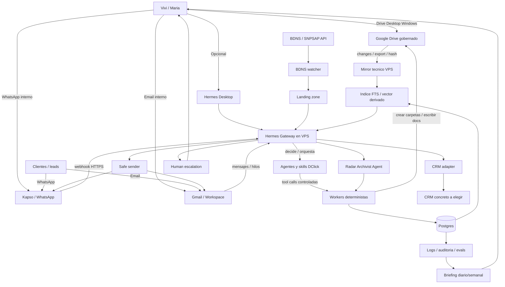

# 03 - Technical Pre-Sales Blueprint

## 1. Executive Technical Summary

DClick IA se disena como un sistema propio, always-on y gobernado para vigilancia de subvenciones, atencion cliente/comercial y produccion documental operativa. El alcance aprobado no es una demo ni una coleccion de borradores: incluye servidor, runtime agentic, workers deterministas, Drive gobernado, radar BDNS/Canarias, canales email/WhatsApp, CRM adapter, knowledge layer, logs, seguridad, evals y training. [SRC-001] [SRC-002] [SRC-018]

La arquitectura objetivo es: VPS como instalacion unica, Hermes como runtime agentic central, workers deterministas para acciones criticas, Google Drive como casa humana, mirror tecnico regenerable, Markdown/metadatos como fuente operativa auditable, indice ligero derivado, Kapso + Hermes como via WhatsApp, email via Hermes/Gmail/Workspace y CRM como memoria comercial conectable. [SRC-002] [SRC-004] [SRC-005] [SRC-006] [SRC-008] [SRC-011] [SRC-013]

Drive es la casa. Hermes es el cerebro. Los workers son las manos. Kapso es la boca de WhatsApp. El indice es la memoria rapida. El CRM es la memoria comercial. [SRC-001]

El diseno mantiene autonomia por defecto solo para casos low-risk y claros, con fuentes/citas, logs y escalado humano cuando haya riesgo, falta de fuente, expediente sensible, queja, decision juridica/fiscal o compromiso comercial. [SRC-002] [SRC-010] [SRC-015]

No se reabre Hermes, Kapso + Hermes, n8n fuera del core, Drive como superficie humana, atencion low-risk autonoma ni CRM adapter agnostico. Stage 03 disena como se implementan, que permisos tienen, que validaciones tecnicas requieren y que limites preservan seguridad. [SRC-002] [SRC-005] [SRC-011] [SRC-018]

Este blueprint no cierra precio, SLA, contrato, anexos legales, plan de ejecucion, backlog atomizado, arbol final de repo ni schemas definitivos. Deja a Stage 04 una base tecnica clara para convertir el sistema en propuesta comercial sin inventar alcance. [SRC-002] [SRC-019]

## 2. Approved Scope Baseline

### Nucleo no negociable

| Bloque | Decision tecnica de Stage 03 | Fuentes |
| --- | --- | --- |
| VPS / instalacion unica | Disenar como servidor always-on con servicios observables, Postgres, workers, backups y secretos fuera de repo; no depender de PCs locales. | [SRC-001] [SRC-004] |
| Hermes runtime | Usarlo como core agentic y gateway de coordinacion; no reabrir si entra salvo bloqueo grave. | [SRC-002] [SRC-005] [SRC-018] |
| Workers deterministas | Ejecutar acciones estructurales con validacion, idempotencia, logs y permisos: BDNS, Drive, CRM, indice, safe sender y audit. | [SRC-001] [SRC-004] [SRC-018] |
| Drive Desktop + Drive gobernado | Mantener Drive como superficie humana principal para Vivi/Maria; operar solo carpetas gobernadas. | [SRC-001] [SRC-002] [SRC-006] [SRC-017] |
| Mirror tecnico | Crear mirror regenerable por API/manifest para busqueda e indexacion, sin sync bidireccional caotico. | [SRC-006] [SRC-008] |
| Markdown/metadatos | Usar Markdown y metadatos como fuente operativa visible y auditable para outputs y manifests. | [SRC-001] [SRC-008] |
| BDNS watcher/radar | Incluir radar Canarias con pesca determinista, landing zone, dedupe, scoring inicial y archivado. | [SRC-001] [SRC-007] |
| Atencion low-risk por email | Incluir canal principal email via Hermes y/o Gmail/Workspace, con clasificacion y escalado. | [SRC-010] [SRC-012] |
| WhatsApp via Kapso + Hermes | Incluir como canal objetivo decidido; configuracion Kapso/Meta/numeros/templates es despliegue, no decision de alcance. | [SRC-002] [SRC-011] [SRC-018] |
| Logs/auditoria | Registrar acciones, decisiones de riesgo, sources, tool calls, envios, escalados y errores. | [SRC-015] [SRC-016] |
| Seguridad, permisos y escalado | Separar toolsets por canal, limitar datos, pedir aprobacion humana en high-risk y envios masivos. | [SRC-010] [SRC-015] |
| Training/runbook | Incluir manual operativo y entrenamiento de Vivi/Maria sin terminal, GitHub ni repositorios. | [SRC-002] [SRC-017] |

### Capacidades incluidas

| Capacidad | Decision tecnica de Stage 03 | Fuentes |
| --- | --- | --- |
| Equipo IA Analista bajo demanda | Baseline funcional de 8 outputs, escrito en Drive con fuentes/citas y logs de run. | [SRC-001] [SRC-009] |
| Knowledge layer / indice ligero derivado | Indice regenerable desde Drive/mirror/Markdown; no fuente de verdad. | [SRC-008] [SRC-015] |
| CRM adapter | Contrato agnostico para contactos, oportunidades, conversaciones, tareas, notas, tags, consentimientos e intereses. | [SRC-013] |
| Preparacion de campanas | Preparar copy, segmento, CTA, email/WhatsApp/newsletter y approval request; no envio masivo sin aprobacion. | [SRC-014] [SRC-015] |
| Briefings | Resumen diario/semanal de eventos, oportunidades, escalados, campanas pendientes y errores. | [SRC-017] [SRC-018] |
| Evals y observabilidad basica | Test sets, golden answers, contract tests, healthchecks, rollback de auto-respuesta y logs consultables. | [SRC-016] |

### Activacion operativa condicionada

| Condicion | Afecta a | Interpretacion en Stage 03 | Fuentes |
| --- | --- | --- | --- |
| Workspace/Gmail | Drive, Gmail, permisos, mirror | Parametro de configuracion y go/no-go de produccion; no expulsa Drive/email del alcance. | [SRC-006] [SRC-012] |
| Kapso/Meta/numero/webhook/templates | WhatsApp | Parametros normales de despliegue del canal incluido; Cloud API directa queda fallback ante bloqueo grave. | [SRC-011] |
| CRM concreto | CRM visual y UX | El adapter entra; el proveedor se decide por adopcion/API y criterio self-host/SaaS. | [SRC-013] |
| Envio masivo real | Campanas | Solo con opt-in, bajas, aprobacion humana, reputacion y logs. | [SRC-014] [SRC-015] |
| Autonomia sobre expedientes activos | Atencion cliente | Depende de taxonomia, fuentes, test set, RGPD y validacion DClick/legal. | [SRC-010] [SRC-015] [SRC-016] |
| Indexacion de datos sensibles | Knowledge/RAG | Requiere permisos, retencion, proveedor LLM/embeddings y decision RGPD. | [SRC-008] [SRC-015] |
| RGPD/proveedores/retencion | Todo el sistema | Condiciona produccion y promesas de autonomia, no el diseno preventa. | [SRC-015] |

## 3. Architecture Overview

Arquitectura general: un VPS aloja Hermes, workers, Postgres, mirror, indice, logs y adaptadores. Vivi/Maria interactuan por Drive Desktop, email, WhatsApp y opcionalmente Hermes Desktop. Clientes/leads entran por email/WhatsApp. BDNS alimenta el radar. Drive conserva outputs humanos. El CRM conserva memoria comercial. [SRC-001] [SRC-004] [SRC-018]

Principios de control:

- Hermes no ejecuta directamente cambios estructurales criticos; llama a workers deterministas con contratos, permisos e idempotencia. [SRC-001] [SRC-005] [SRC-018]
- Drive y Markdown son la base humana/canonica; mirror e indice son derivados y regenerables. [SRC-006] [SRC-008]
- Canales internos y externos tienen toolsets separados. Los clientes/leads no acceden a tools administrativas. [SRC-005] [SRC-010] [SRC-015]
- Safe sender gobierna envios: auto-respuesta low-risk permitida, high-risk escala, campanas masivas requieren aprobacion. [SRC-010] [SRC-014] [SRC-015]

## 4. Module Blueprint Cards

### 4.1 VPS / Runtime / Infra

**Proposito:** alojar una instalacion unica, always-on y observable para todo el sistema DClick IA. [SRC-004]

**Responsabilidades:** ejecutar Hermes, workers, Postgres, logs, mirror, indice, adaptadores, backups, healthchecks y endpoints webhook.

**Inputs:** webhooks Kapso, eventos Gmail/Workspace, polling BDNS, Drive changes, comandos internos, jobs programados.

**Outputs:** servicios vivos, eventos internos, logs, backups, status, alertas y artefactos generados por workers.

**Interfaces humanas:** ninguna interfaz tecnica para Vivi/Maria; el servidor se opera por equipo tecnico y expone resultados por Drive/email/WhatsApp.

**Integraciones tecnicas:** Linux VPS, Docker Compose o systemd, Postgres, HTTPS, DNS, secretos, Hermes, Google, Kapso, CRM.

**Workers/tools involucrados:** `infra_healthcheck_services`, `infra_backup_postgres`, `worker_run_job`, `audit.log_action`.

**Datos principales:** `service_status`, `WorkerJob`, `AuditLog`, secretos externos al repo, backups.

**Riesgos:** caida de gateway, perdida de datos, secretos expuestos, drift manual de configuracion.

**Limites / no-promesas:** no se cierra proveedor VPS, CI/CD final, SLA ni plan de ejecucion en Stage 03.

**Stage 04 translation:** presentar como servidor DClick IA siempre activo con monitorizacion y copias, sin entrar en detalles de Docker/systemd.

### 4.2 Hermes Agentic Core

**Proposito:** actuar como runtime agentic central, gateway de canales y coordinador de agentes, skills y workers. [SRC-002] [SRC-005]

**Responsabilidades:** recibir mensajes, clasificar intencion/riesgo, decidir toolsets, delegar a agentes, lanzar background tasks, preparar respuestas y escalar.

**Inputs:** mensajes email/WhatsApp, comandos internos, eventos BDNS/Drive/CRM, cron jobs, contexto RAG/CRM.

**Outputs:** decisiones agentic, llamadas a tools, respuestas, escalados, jobs, briefings y logs.

**Interfaces humanas:** WhatsApp/email internos, Hermes Desktop opcional, briefings y notificaciones.

**Integraciones tecnicas:** Kapso plugin, Gmail/Hermes email, workers HTTP/MCP/local controlado, LLM provider, Postgres/logs.

**Workers/tools involucrados:** `dclick_route_message`, `risk.classify`, `knowledge.search`, `crm.lookup_contact`, `human.escalate_case`.

**Datos principales:** `agent_session`, `agent_decision`, `tool_permission`, `EscalationCase`, `AuditLog`.

**Riesgos:** toolsets amplios, contexto insuficiente para subagentes, inestabilidad 24/7, respuesta sin fuente.

**Limites / no-promesas:** Hermes es arquitectura objetivo, pero produccion requiere smoke tests de gateway, permisos, canales y logs.

**Stage 04 translation:** comunicar como cerebro IA coordinador que entiende peticiones y activa herramientas seguras.

### 4.3 Workers deterministas

**Proposito:** ejecutar acciones estructurales que no deben depender de salida libre del agente. [SRC-001] [SRC-018]

**Responsabilidades:** validar inputs, aplicar permisos, crear carpetas, escribir manifests, deduplicar BDNS, actualizar CRM, enviar seguro, indexar y registrar logs.

**Inputs:** tool calls de Hermes, eventos programados, payloads validados, aprobaciones humanas.

**Outputs:** acciones idempotentes, registros, errores controlados, eventos internos y referencias a archivos/CRM.

**Interfaces humanas:** solo estados, errores y solicitudes de aprobacion visibles por briefing/email/WhatsApp/Drive.

**Integraciones tecnicas:** Drive API, Gmail API, Kapso, BDNS, Postgres, CRM API, indice.

**Workers/tools involucrados:** familias BDNS, Drive, Knowledge, Messaging, CRM, Campaign y Audit definidas en seccion 8.

**Datos principales:** `WorkerJob`, `AuditLog`, `DriveManifest`, `RiskDecision`, `ConsentRecord`.

**Riesgos:** contratos flojos, tool injection, idempotencia insuficiente, accion sin log.

**Limites / no-promesas:** no se cierran endpoints ni implementacion interna final; se definen contratos funcionales.

**Stage 04 translation:** explicar que las acciones criticas se ejecutan con controles y trazabilidad, no como automatismos opacos.

### 4.4 Google Workspace / Drive Desktop / Drive gobernado

**Proposito:** dar a Vivi/Maria una biblioteca humana en carpetas conocidas y una fuente visible para outputs. [SRC-002] [SRC-006] [SRC-017]

**Responsabilidades:** alojar documentos, outputs, carpetas de subvenciones, evidencias, resumenes, checklists, campanas y manifests visibles.

**Inputs:** archivos humanos, documentos BDNS, outputs analistas, Markdown, PDFs, Google Docs, cambios manuales.

**Outputs:** estructura documental gobernada, Drive IDs, permisos, cambios detectables y contenido para mirror.

**Interfaces humanas:** Drive Desktop en Windows, navegador Drive si procede, carpetas compartidas y documentos finales.

**Integraciones tecnicas:** Drive API, Shared Drives o carpeta gobernada, OAuth/service account, Drive for desktop.

**Workers/tools involucrados:** `drive.create_subsidy_workspace`, `drive.upload_file`, `drive.write_markdown`, `drive.write_manifest`.

**Datos principales:** `DriveManifest`, `SubsidyDocument`, `AnalysisOutput`, `KnowledgeDocument`.

**Riesgos:** scopes excesivos, conflictos de edicion, operar todo Drive, propiedad individual si no hay Shared Drive.

**Limites / no-promesas:** no se promete migracion historica completa ni operacion sobre todo el Drive/correo.

**Stage 04 translation:** presentar como biblioteca DClick IA en Drive, organizada y usable desde Windows.

### 4.5 Mirror tecnico Drive - VPS

**Proposito:** permitir busqueda, indexacion y procesamiento rapido sin recorrer Drive en cada consulta. [SRC-006] [SRC-008]

**Responsabilidades:** sincronizar carpetas gobernadas, exportar documentos, calcular hashes, mantener manifests, detectar cambios y reconstruirse desde Drive.

**Inputs:** Drive changes, resync periodico, exports, hashes, metadatos de archivos.

**Outputs:** `MirrorFile`, snapshots, eventos `drive.file.changed`, entradas para ingestion knowledge.

**Interfaces humanas:** no es interfaz humana; los usuarios ven Drive, no el mirror.

**Integraciones tecnicas:** Drive API `changes.list`, `files.export`, push notifications si aplica, Postgres/filesystem interno.

**Workers/tools involucrados:** `drive.sync_folder`, `drive.rebuild_mirror`, `drive.resolve_conflict`, `knowledge.ingest_document`.

**Datos principales:** `DriveManifest`, `MirrorFile`, `sync_conflict`, hashes y timestamps.

**Riesgos:** conflictos silenciosos, webhooks expirados, rutas renombradas, duplicados.

**Limites / no-promesas:** no sync bidireccional salvaje; Drive sigue siendo canonico y el mirror es descartable.

**Stage 04 translation:** comunicar como copia tecnica segura que acelera busqueda y analisis, sin cambiar la forma de trabajo humana.

### 4.6 Knowledge layer: Markdown + metadatos + indice ligero

**Proposito:** recuperar informacion con fuentes sin cargar todos los documentos ni convertir el indice en fuente de verdad. [SRC-008]

**Responsabilidades:** normalizar documentos, chunking, FTS/vector search, filtros por metadatos, citas, rebuild y fallback sin fuente.

**Inputs:** Markdown, PDFs/Docs exportados, documentos BDNS, outputs analistas, notas CRM permitidas.

**Outputs:** chunks, embeddings si se aprueban, resultados, citas, `sources_used`, eventos de indexado.

**Interfaces humanas:** respuestas citadas, fuentes enlazadas en Drive, avisos de "sin fuente suficiente".

**Integraciones tecnicas:** Postgres FTS, pgvector si se valida, embeddings provider o fallback FTS, mirror Drive.

**Workers/tools involucrados:** `knowledge.ingest_document`, `knowledge.search`, `knowledge.search_subsidy_docs`, `knowledge.cite_sources`, `knowledge.rebuild_index`.

**Datos principales:** `KnowledgeDocument`, `DocumentChunk`, `rag_query`, `source_ref`.

**Riesgos:** mala extraccion PDF, cita erronea, embeddings con datos sensibles, indice usado como canonico.

**Limites / no-promesas:** no responder consultas especificas sin fuente; no indexar datos sensibles sin validacion RGPD.

**Stage 04 translation:** describir como memoria documental rapida con respuestas apoyadas en fuentes.

### 4.7 BDNS watcher / Radar Canarias

**Proposito:** detectar nuevas subvenciones relevantes, especialmente Canarias, sin vigilancia manual diaria. [SRC-001] [SRC-007]

**Responsabilidades:** consultar BDNS/SNPSAP, paginar, descargar detalles/documentos, deduplicar, puntuar relevancia y activar archivado/alerta.

**Inputs:** ventana temporal, filtros Canarias/organos/keywords, historico, criterios DClick, API BDNS.

**Outputs:** candidatos, landing JSONL, documentos descargados, score, razones, eventos y notificaciones.

**Interfaces humanas:** alertas a Vivi/Maria, resumen diario/semanal, carpeta Drive por convocatoria relevante.

**Integraciones tecnicas:** BDNS/SNPSAP API, posible cliente propio o `bdns-fetch` como apoyo de prueba tecnica, Drive, Postgres.

**Workers/tools involucrados:** `bdns.search_new_calls`, `bdns.fetch_call_detail`, `bdns.download_documents`, `bdns.mark_seen`, `bdns.score_relevance`.

**Datos principales:** `SubsidyCall`, `SubsidyDocument`, `subsidy_relevance`, `WorkerJob`.

**Riesgos:** rate limits, cambios API, ruido, falsos negativos, licencia GPLv3 si se usa `bdns-fetch`.

**Limites / no-promesas:** no garantizar deteccion perfecta ni concesion; scoring se valida con muestras DClick.

**Stage 04 translation:** vender como radar de oportunidades de subvencion con alertas y documentacion organizada.

### 4.8 Archivador agentic + commit determinista

**Proposito:** separar interpretacion semantica de ejecucion estructural para archivar subvenciones sin caos documental. [SRC-001] [SRC-007] [SRC-018]

**Responsabilidades:** proponer relevancia, tags, carpeta destino y resumen; luego worker valida y crea Drive/manifest.

**Inputs:** `SubsidyCall`, documentos BDNS, score, reglas de naming, taxonomia DClick.

**Outputs:** propuesta de archivado, carpeta Drive, Markdown resumen, manifest, eventos `subsidy.archived`.

**Interfaces humanas:** notificacion con razon de relevancia y enlace a carpeta; posibilidad de marcar relevante/no relevante.

**Integraciones tecnicas:** Hermes, Drive worker, BDNS worker, Postgres, Knowledge ingestion.

**Workers/tools involucrados:** `bdns.score_relevance`, `drive.create_subsidy_workspace`, `drive.write_markdown`, `audit.log_action`.

**Datos principales:** `SubsidyCall`, `DriveManifest`, `AuditLog`, `RiskDecision`.

**Riesgos:** agente crea estructura incorrecta, duplicados, naming inestable, criterios de relevancia pobres.

**Limites / no-promesas:** el agente no escribe Drive directamente; el commit determinista valida estructura.

**Stage 04 translation:** explicar que el sistema no solo detecta, tambien ordena y deja evidencia en Drive.

### 4.9 Equipo IA Analista bajo demanda

**Proposito:** analizar convocatorias y producir el paquete estandar de outputs reutilizables. [SRC-001] [SRC-009]

**Responsabilidades:** cargar fuentes, analizar convocatoria, generar 8 outputs, citar fuentes, guardar en Drive, actualizar indice y notificar.

**Inputs:** convocatoria BDNS, documentos, perfil cliente/sector si aplica, solicitud de Vivi/Maria, contexto RAG.

**Outputs:** resumen tecnico interno, checklist requisitos, checklist solicitud, checklist justificacion, alertas/letra pequena, resumen web, newsletter y post RRSS.

**Interfaces humanas:** solicitud por WhatsApp/email/Hermes Desktop opcional, resultados en Drive, notificacion final.

**Integraciones tecnicas:** Hermes subagentes/skills, Drive, Knowledge, BDNS, Postgres logs.

**Workers/tools involucrados:** `analysis_generate_standard_outputs`, `analysis_extract_requirements`, `analysis_write_drive_outputs`, `knowledge.cite_sources`.

**Datos principales:** `AnalysisRun`, `AnalysisOutput`, `analysis_finding`, `source_ref`.

**Riesgos:** alucinacion de requisitos, fuente incompleta, outputs inconsistentes, latencia/coste.

**Limites / no-promesas:** no sustituye dictamen juridico/fiscal definitivo; outputs de riesgo pueden requerir revision.

**Stage 04 translation:** comunicar como equipo IA analista que acelera documentacion y comunicacion sobre subvenciones.

### 4.10 Atencion cliente/comercial autonoma

**Proposito:** reducir atencion manual respondiendo de forma autonoma a casos low-risk y escalando el resto. [SRC-010]

**Responsabilidades:** clasificar remitente/intencion/riesgo, consultar CRM/RAG, pedir datos faltantes, responder, escalar y registrar.

**Inputs:** mensajes email/WhatsApp, adjuntos, CRM context, knowledge sources, riesgo, opt-in.

**Outputs:** respuesta enviada, solicitud de datos, escalado, nota CRM, task, log y briefing.

**Interfaces humanas:** clientes/leads por email/WhatsApp; Vivi/Maria reciben escalados y resumenes.

**Integraciones tecnicas:** Hermes, Gmail, Kapso, CRM adapter, Knowledge, Safety/Audit.

**Workers/tools involucrados:** `customer_classify_sender`, `customer_classify_intent`, `risk.classify`, `crm.log_conversation`, `human.escalate_case`.

**Datos principales:** `Contact`, `Conversation`, `Message`, `RiskDecision`, `EscalationCase`.

**Riesgos:** respuesta incorrecta, mezcla de clientes, envio sin fuente, no escalado high-risk.

**Limites / no-promesas:** no es "cero revision humana"; autonomia solo low-risk y con fuentes/reglas.

**Stage 04 translation:** presentar como atencion automatizada con control humano por riesgo.

### 4.11 Email via Hermes/Gmail/Workspace

**Proposito:** operar email como canal principal de atencion y seguimiento. [SRC-012]

**Responsabilidades:** recibir hilos, leer adjuntos permitidos, aplicar labels, crear drafts/respuestas, enviar safe replies y registrar CRM.

**Inputs:** mensajes Gmail, hilos, labels, adjuntos, remitente, reglas de routing.

**Outputs:** label aplicado, draft, reply, escalation, CRM note, audit log.

**Interfaces humanas:** cuenta dedicada o alias, labels visibles, escalados a Vivi/Maria, respuestas al cliente.

**Integraciones tecnicas:** Gmail API preferente si se valida, Hermes email/IMAP como opcion, Pub/Sub o polling, dominio SPF/DKIM/DMARC.

**Workers/tools involucrados:** `email.read_thread`, `email.reply_thread`, `email.send_new`, `email.apply_label`, `email.sync_to_crm`.

**Datos principales:** `Conversation`, `Message`, `email_thread`, `email_decision`, `ConsentRecord`.

**Riesgos:** scopes restricted, perdida de eventos push/history, mala entregabilidad, reply a hilo equivocado.

**Limites / no-promesas:** no acceso irrestricto a todo correo historico; produccion depende de cuenta/scopes/dominio.

**Stage 04 translation:** explicar como canal de atencion por email integrado con memoria y escalado.

### 4.12 WhatsApp via Kapso + Hermes

**Proposito:** conectar WhatsApp al sistema mediante Kapso + Hermes como via objetivo incluida. [SRC-002] [SRC-011]

**Responsabilidades:** recibir webhooks, validar firma/secreto, procesar texto/media/audio/PDF si procede, responder, registrar logs y gestionar broadcasts aprobados.

**Inputs:** webhook WhatsApp, contacto, media, opt-in, status, template.

**Outputs:** respuesta, media cacheada, escalado, CRM log, campaign metrics.

**Interfaces humanas:** WhatsApp interno para Vivi/Maria y WhatsApp externo para clientes/leads con toolsets separados.

**Integraciones tecnicas:** Kapso API, Hermes plugin, Meta WhatsApp Cloud API/proxy, webhook HTTPS, secrets, fallback Cloud API directa.

**Workers/tools involucrados:** `whatsapp.send_reply`, `whatsapp.download_media`, `whatsapp.check_allowed_user`, `whatsapp.prepare_template_message`, `human.request_approval`.

**Datos principales:** `Message`, `Conversation`, `whatsapp_contact`, `ConsentRecord`, `Campaign`.

**Riesgos:** coste/viabilidad Kapso, API drift, webhook inseguro, reputacion/opt-in, numero bloqueado.

**Limites / no-promesas:** no Baileys/WhatsApp Web en produccion; no broadcast ilimitado; Cloud API directa solo fallback ante bloqueo grave.

**Stage 04 translation:** comunicar WhatsApp como canal incluido via tecnologia oficial/controlada y con reglas de uso responsable.

### 4.13 CRM adapter

**Proposito:** desacoplar Hermes/workers del CRM concreto y preservar memoria comercial estructurada. [SRC-013]

**Responsabilidades:** lookup/upsert contacto, crear oportunidad, log conversacion, crear tarea, notas, tags, consentimiento e intereses por subvencion.

**Inputs:** mensajes, contacto, telefono/email, score lead, subvencion, opt-in, owner, status.

**Outputs:** contacto actualizado, oportunidad, nota, task, tag, segmento, evento CRM.

**Interfaces humanas:** vistas del CRM elegido o interfaz tipo hoja segun adopcion.

**Integraciones tecnicas:** Twenty/Baserow/NocoDB/GoHighLevel via adapter; mock adapter para pruebas si hace falta.

**Workers/tools involucrados:** `crm.lookup_contact`, `crm.upsert_contact`, `crm.create_opportunity`, `crm.update_stage`, `crm.add_note`, `crm.create_task`, `crm.log_conversation`.

**Datos principales:** `Contact`, `CRMOpportunity`, `Conversation`, `Task`, `ConsentRecord`.

**Riesgos:** CRM no adoptado, lock-in, schema drift, API limits.

**Limites / no-promesas:** no cerrar proveedor como definitivo sin validacion UX/API con DClick.

**Stage 04 translation:** presentar como memoria comercial conectable que evita perder leads y seguimiento.

### 4.14 CRM concreto / opciones

**Proposito:** ofrecer una ruta de seleccion operativa sin acoplar el blueprint a un proveedor. [SRC-013]

**Responsabilidades:** evaluar CRM real vs hoja visual vs suite SaaS, asegurar API, permisos, adopcion y export.

**Inputs:** preferencia DClick, self-host vs SaaS, UX Vivi/Maria, entidades minimas, licencias/proveedor.

**Outputs:** recomendacion operativa, adapter binding, vistas CRM, test UX/API.

**Interfaces humanas:** CRM visual elegido para contactos, oportunidades, tareas y notas.

**Integraciones tecnicas:** Twenty, Baserow, NocoDB o GoHighLevel.

**Workers/tools involucrados:** mismos contratos `crm_*`; proveedor concreto solo cambia adapter.

**Datos principales:** `Contact`, `CRMOpportunity`, `CampaignInterest`, `Task`, `Conversation`.

**Riesgos:** sobrecomplicar CRM, elegir herramienta que no usan, lock-in GoHighLevel, hoja sin semantica CRM.

**Limites / no-promesas:** no vender "CRM X definitivo" hasta decision DClick y prueba de adopcion/API.

**Stage 04 translation:** explicar que el sistema se conecta a una memoria comercial y permite elegir la herramienta mas adecuada.

### 4.15 Campanas/newsletters/broadcasts con approval gate

**Proposito:** convertir subvenciones relevantes en comunicaciones preparadas, sin envio masivo autonomo. [SRC-014] [SRC-015]

**Responsabilidades:** generar copy, segmento, CTA, preview, draft email/WhatsApp/newsletter, request approval, envio solo aprobado y metricas.

**Inputs:** `SubsidyCall`, segmento CRM, opt-in, template, canal, aprobador.

**Outputs:** draft, preview, approval request, send job, metrics, CRM notes.

**Interfaces humanas:** Vivi/Maria aprueban o rechazan; clientes reciben solo envios permitidos.

**Integraciones tecnicas:** Kapso Broadcasts si se valida, Gmail/email sender, CRM segments, safe sender, audit.

**Workers/tools involucrados:** `campaign.prepare`, `campaign.segment_contacts`, `campaign.request_approval`, `campaign.send_approved`, `campaign.log_metrics`.

**Datos principales:** `Campaign`, `ConsentRecord`, `campaign_recipient`, `campaign_metric`, `AuditLog`.

**Riesgos:** envio sin consentimiento, reputacion de dominio/WhatsApp, segmentacion incorrecta, metricas fragmentadas.

**Limites / no-promesas:** no envio masivo automatico, no spam, no promesas de elegibilidad, no broadcast sin opt-in.

**Stage 04 translation:** vender preparacion de campanas con control humano y trazabilidad.

### 4.16 Seguridad / RGPD / permisos

**Proposito:** proteger datos, herramientas, canales y decisiones automaticas. [SRC-015]

**Responsabilidades:** permisos minimos, separacion de canales, secretos, redaccion, opt-in, retencion, consent records, escalado y aprobaciones.

**Inputs:** mensajes, datos CRM, adjuntos, source refs, decisiones de riesgo, tool calls.

**Outputs:** permission decisions, blocks, escalados, logs, consent checks, redacted summaries.

**Interfaces humanas:** aprobaciones, escalados, avisos de riesgo, manual de uso seguro.

**Integraciones tecnicas:** Google scopes, Kapso/Meta, CRM, LLM provider, Postgres logs, secrets manager o politica equivalente.

**Workers/tools involucrados:** `risk.classify`, `permission.check`, `audit.log_action`, `human.escalate_case`, `human.request_approval`.

**Datos principales:** `RiskDecision`, `ConsentRecord`, `AuditLog`, `security_event`, `data_retention_policy`.

**Riesgos:** fuga de datos, tool abuse, tratamiento sin base legal, logs excesivos, proveedor no aprobado.

**Limites / no-promesas:** Stage 03 no redacta contrato ni cierra RGPD; marca go/no-go antes de produccion.

**Stage 04 translation:** comunicar control, trazabilidad y escalado humano como parte del sistema.

### 4.17 Logs / auditoria / observabilidad / evals

**Proposito:** hacer medible y auditable la autonomia del sistema. [SRC-016]

**Responsabilidades:** logs estructurados, action log, risk log, evals, golden answers, contract tests, healthchecks, alerts y rollback.

**Inputs:** tool calls, eventos, respuestas, clasificaciones, jobs, errores, fixtures.

**Outputs:** `AuditLog`, `eval_result`, alertas, incidentes, reports, briefing de errores.

**Interfaces humanas:** briefing diario/semanal, escalados, incidencias y estado de jobs.

**Integraciones tecnicas:** Postgres, Hermes logs, Kapso/Gmail IDs, BDNS snapshots, Drive manifests, CRM adapter tests.

**Workers/tools involucrados:** `eval_run_customer_care_set`, `eval_run_bdns_watcher_fixture`, `observability_emit_metric`, `rollback_disable_autoreply`.

**Datos principales:** `AuditLog`, `WorkerJob`, `eval_case`, `eval_result`, `incident`.

**Riesgos:** fallo silencioso, logs con PII excesiva, autonomia sin test set, alert fatigue.

**Limites / no-promesas:** no se promete SLA ni observabilidad enterprise; se exige evidencia minima para activar autonomia.

**Stage 04 translation:** presentar como sistema con control, trazabilidad y mejora continua.

### 4.18 Training / operaciones / soporte

**Proposito:** asegurar adopcion de Vivi/Maria usando superficies no tecnicas. [SRC-017]

**Responsabilidades:** manual operativo, training Drive Desktop, comandos por WhatsApp/email, aprobacion de campanas, escalados, soporte y runbooks.

**Inputs:** dudas, solicitudes de analisis, aprobaciones, reportes de fallo, feedback de usuarias.

**Outputs:** manual, briefing, soporte, runbook actualizado, evidencias de training.

**Interfaces humanas:** Drive Desktop, WhatsApp, email, Hermes Desktop opcional.

**Integraciones tecnicas:** canales internos, Drive, logs, approval tools, support ticket simple.

**Workers/tools involucrados:** `ops_send_daily_briefing`, `ops_explain_last_action`, `ops_open_support_ticket`, `ops_update_manual`, `campaign.request_approval`.

**Datos principales:** `training_session`, `support_ticket`, `operator_command`, `runbook_entry`.

**Riesgos:** baja adopcion, aprobaciones ambiguas, dependencia excesiva de soporte tecnico, confusion de limites.

**Limites / no-promesas:** no exponer terminal, GitHub, repos, endpoints internos ni secretos a usuarias.

**Stage 04 translation:** comunicar acompanamiento operativo y uso desde herramientas conocidas.

## 5. End-to-End Workflows

### 5.1 Nueva subvencion detectada

| Campo | Blueprint |
| --- | --- |
| Trigger | Job programado `bdns.poll.started` o polling manual controlado. |
| Pasos | BDNS watcher consulta ventana; guarda landing; deduplica por `codigoBDNS`/detalle/hash; descarga documentos; Hermes/archivador propone relevancia; commit worker crea Drive/manifest; mirror sincroniza; indice ingiere; notifica. |
| Agentes/workers | BDNS watcher, Radar Archivist Agent, Drive worker, Knowledge worker, Daily Briefing Agent. |
| Datos leidos | BDNS API, historico visto, filtros Canarias/sectores, criterios DClick. |
| Datos escritos | `SubsidyCall`, `SubsidyDocument`, landing JSONL, `DriveManifest`, `KnowledgeDocument`, `AuditLog`. |
| Salida | Carpeta Drive, resumen Markdown, notificacion interna y entrada en briefing. |
| Logs | `bdns.poll.started`, `bdns.call.detected`, `subsidy.archived`, `knowledge.index.updated`, `audit.log.written`. |
| Escalado | Si API falla, documentos no descargan, relevancia ambigua o scoring contradice reglas. |
| Limites | No prometer cobertura perfecta; no activar campana sin aprobacion/opt-in. |

### 5.2 Lanzar Equipo IA Analista

| Campo | Blueprint |
| --- | --- |
| Trigger | Vivi/Maria pide analisis por WhatsApp/email/Hermes Desktop o desde una subvencion archivada. |
| Pasos | Hermes identifica subvencion; valida fuentes; crea `AnalysisRun`; lanza background task; subagentes generan outputs; worker escribe Drive; knowledge reindexa; notifica final. |
| Agentes/workers | DClick Orchestrator, Subsidy Analysis Crew, Knowledge Librarian, Drive worker, Audit worker. |
| Datos leidos | Convocatoria, documentos BDNS, fuentes Drive, criterio sectorial y perfil si aplica. |
| Datos escritos | `AnalysisRun`, 8 `AnalysisOutput`, `AuditLog`, chunks/citas. |
| Salida | Paquete de 8 outputs: resumen tecnico, checklist requisitos, checklist solicitud, checklist justificacion, alertas/letra pequena, resumen web, newsletter y post RRSS. |
| Logs | `analysis.requested`, `analysis.completed`, `drive.file.changed`, `knowledge.index.updated`. |
| Escalado | Si faltan documentos, hay contradiccion, elegibilidad dudosa o output high-risk. |
| Limites | No dictamen juridico/fiscal definitivo; claims clave deben tener fuente. |

### 5.3 Lead nuevo pregunta por ayudas

| Campo | Blueprint |
| --- | --- |
| Trigger | Email o WhatsApp entrante de remitente no conocido o lead sin oportunidad activa. |
| Pasos | Canal recibe mensaje; Hermes clasifica remitente/intencion/riesgo; CRM lookup/upsert; pide datos faltantes si procede; consulta RAG/BDNS; responde low-risk o escala; registra CRM. |
| Agentes/workers | Customer Care Agent, Sales Prequalification Agent, CRM Operator Agent, Safety Agent, safe sender. |
| Datos leidos | Mensaje, CRM, consent records, fuentes knowledge, subvenciones relevantes. |
| Datos escritos | `Contact`, `Conversation`, `Message`, `CRMOpportunity` si procede, `RiskDecision`, `AuditLog`. |
| Salida | Respuesta, pregunta de precalificacion, cita/handoff humano o tarea comercial. |
| Logs | `message.received`, `sender.classified`, `intent.classified`, `risk.classified`, `crm.contact.upserted`, `reply.sent` o `case.escalated`. |
| Escalado | Riesgo medio/alto, falta de fuente, queja, promesa de resultado, datos sensibles o tono conflictivo. |
| Limites | No prometer concesion ni asesoramiento definitivo. |

### 5.4 Cliente existente pregunta por expediente/subvencion

| Campo | Blueprint |
| --- | --- |
| Trigger | Email/WhatsApp de contacto existente o vinculado a oportunidad/expediente. |
| Pasos | Identificar contacto; delimitar expediente/subvencion; buscar contexto permitido; clasificar riesgo; responder con fuente si low-risk; escalar si expediente sensible o falta fuente; log CRM. |
| Agentes/workers | Customer Care Agent, Knowledge Librarian, CRM Operator Agent, Safety Agent. |
| Datos leidos | CRM, historial permitido, documentos Drive/knowledge, mensajes previos. |
| Datos escritos | `Conversation`, `Message`, `RiskDecision`, `EscalationCase`, nota CRM. |
| Salida | Respuesta con fuente, acuse, peticion de datos o escalado a Vivi/Maria. |
| Logs | `message.received`, `risk.classified`, `knowledge.search`, `reply.sent`, `case.escalated`, `crm.note.added`. |
| Escalado | Siempre en expediente activo sensible, documentacion fiscal/personal, reclamacion, compromiso economico o falta de fuente. |
| Limites | No cruzar datos de otros clientes; no operar expedientes sin permisos/RGPD. |

### 5.5 Campana por nueva subvencion

| Campo | Blueprint |
| --- | --- |
| Trigger | Subvencion relevante archivada o analisis completado con potencial comercial. |
| Pasos | Campaign Agent prepara copy, segmento, CTA y canal; safe sender crea preview; solicita aprobacion; si se aprueba y hay opt-in, envia; registra metricas. |
| Agentes/workers | Campaign Agent, CRM adapter, safe sender, Safety Agent. |
| Datos leidos | `SubsidyCall`, `AnalysisOutput`, `Contact`, tags, opt-in, templates. |
| Datos escritos | `Campaign`, `ConsentRecord`, `campaign_recipient`, metricas, notas CRM, `AuditLog`. |
| Salida | Draft/previews y, si procede, envio aprobado. |
| Logs | `campaign.draft.created`, `campaign.approval.requested`, `campaign.sent`, `campaign.metrics.updated`. |
| Escalado | Falta de consentimiento, segmento ambiguo, copy de riesgo, template no aprobado o volumen alto. |
| Limites | Preparacion entra; envio masivo automatico sin aprobacion no entra. |

### 5.6 Briefing diario/semanal

| Campo | Blueprint |
| --- | --- |
| Trigger | Cron diario/semanal o solicitud interna. |
| Pasos | Recoger eventos/logs; resumir nuevas subvenciones, analisis, escalados, oportunidades, campanas pendientes, errores y healthchecks; enviar a canal interno. |
| Agentes/workers | Daily Briefing Agent, Observability worker, CRM adapter, BDNS worker. |
| Datos leidos | `AuditLog`, `WorkerJob`, `SubsidyCall`, `EscalationCase`, `Campaign`, CRM notes. |
| Datos escritos | briefing Markdown/Drive, mensaje interno, log de entrega. |
| Salida | Resumen operativo accionable para Vivi/Maria. |
| Logs | `briefing.generated`, `briefing.sent`, `audit.log.written`. |
| Escalado | Errores recurrentes, jobs fallidos, escalados sin resolver, riesgos RGPD. |
| Limites | No sustituye soporte tecnico ni cierre de SLA. |

## 6. Data Model Candidate

No es schema definitivo. Marca fuente canonica, derivado, regenerable y sensibilidad para Stage 04/implementacion posterior.

| Entity | Purpose | Key fields | Source of truth | Notes |
| --- | --- | --- | --- | --- |
| `SubsidyCall` | Convocatoria detectada o archivada. | `id`, `codigo_bdns`, `title`, `organ`, `region`, `status`, `dates`, `budget`, `source_url`, `relevance_score` | BDNS + snapshot interno | Publica; canon BDNS, snapshot interno para auditoria. |
| `SubsidyDocument` | Documento oficial de convocatoria. | `id`, `subsidy_id`, `document_type`, `source_url`, `sha256`, `drive_file_id`, `downloaded_at` | BDNS/Drive | Publico salvo anexos; regenerable si fuente sigue disponible. |
| `DriveManifest` | Mapa tecnico de archivos gobernados. | `drive_id`, `file_id`, `path`, `mime_type`, `modified_time`, `version`, `sha256`, `status` | Drive + manifest interno | Derivado de Drive; clave por `file_id`, no path. |
| `MirrorFile` | Copia tecnica en VPS. | `local_path`, `source_file_id`, `export_mime`, `hash`, `indexed_at`, `sync_status` | DriveManifest | Derivado y regenerable. |
| `KnowledgeDocument` | Documento listo para ingestion. | `source_id`, `drive_file_id`, `canonical_status`, `metadata`, `sensitivity`, `updated_at` | Drive/Markdown | Puede ser publico o sensible segun origen. |
| `DocumentChunk` | Fragmento de busqueda. | `chunk_id`, `source_id`, `section`, `page`, `text`, `tsvector`, `embedding_ref` | KnowledgeDocument | Derivado; embeddings sujetos a RGPD. |
| `Contact` | Persona/lead/cliente. | `id`, `name`, `email`, `phone`, `type`, `tags`, `opt_in_status`, `crm_id` | CRM elegido + adapter | Sensible/RGPD. |
| `Conversation` | Hilo multi-canal. | `id`, `channel`, `external_thread_id`, `contact_id`, `status`, `risk_level`, `last_message_at` | Canal + CRM/internal DB | Sensible/RGPD; no mezclar clientes. |
| `Message` | Mensaje individual. | `id`, `conversation_id`, `provider_id`, `direction`, `body_ref`, `attachments`, `risk_level`, `sent_at` | Gmail/Kapso + internal log | Sensible; cuerpo puede redaccionarse. |
| `CRMOpportunity` | Oportunidad comercial o interes. | `id`, `contact_id`, `subsidy_id`, `stage`, `owner`, `source`, `next_step` | CRM elegido | Adapter debe preservar export. |
| `AnalysisRun` | Ejecucion del equipo analista. | `run_id`, `subsidy_id`, `requested_by`, `status`, `risk_level`, `drive_folder_id`, `started_at`, `completed_at` | Internal DB + Drive | Audit trail obligatorio. |
| `AnalysisOutput` | Output generado. | `id`, `analysis_run_id`, `type`, `file_id`, `source_refs`, `review_status` | Drive/Markdown | Baseline de 8 outputs; no schema final. |
| `Campaign` | Campana preparada o enviada. | `id`, `subsidy_id`, `channel`, `audience`, `approval_status`, `template_id`, `sent_at` | Internal DB + sender/CRM | Envio real condicionado a opt-in/aprobacion. |
| `ConsentRecord` | Evidencia de opt-in/baja/base legal. | `id`, `contact_id`, `channel`, `basis`, `status`, `source`, `timestamp` | CRM/legal record | Sensible; requisito para outbound. |
| `EscalationCase` | Caso que requiere humano. | `id`, `conversation_id`, `reason`, `risk`, `summary`, `owner`, `status`, `recommended_reply` | Internal DB/CRM | Central para autonomia segura. |
| `AuditLog` | Trazabilidad de accion/decision. | `id`, `actor`, `channel`, `action`, `target_ref`, `risk`, `source_refs`, `timestamp`, `result` | Internal DB | Minimizar PII; retention pendiente legal. |
| `RiskDecision` | Decision de riesgo. | `id`, `scenario`, `risk`, `allowed_action`, `required_source`, `escalation`, `reason` | Safety worker | Entrenable/evaluable. |
| `WorkerJob` | Ejecucion de worker. | `id`, `job_type`, `status`, `input_hash`, `output_ref`, `retries`, `error_code`, `started_at`, `ended_at` | Internal DB | Operacion/observabilidad. |

## 7. Event and Trigger Model

| Event | Triggered by | Consumed by | Payload summary | Notes |
| --- | --- | --- | --- | --- |
| `bdns.poll.started` | Cron/manual interno | BDNS watcher, audit | ventana, filtros, job_id | No barridos masivos innecesarios. |
| `bdns.call.detected` | BDNS watcher | Archivador, Drive worker | `codigo_bdns`, title, organ, dates | Dedupe antes de notificar. |
| `subsidy.archived` | Commit worker | Drive, knowledge, briefing | subsidy_id, folder_id, manifest | Solo tras validacion determinista. |
| `drive.folder.created` | Drive worker | Audit, briefing | folder_id, path, actor | No borrar sin aprobacion. |
| `drive.file.changed` | Drive changes/polling | Mirror, knowledge | file_id, change_type, modified_time | Requiere resync si hay gap. |
| `knowledge.index.updated` | Knowledge worker | Hermes, briefing | source_id, chunk_count, status | Indice derivado. |
| `message.received` | Gmail/Kapso | Hermes, risk, CRM | channel, external_id, sender, thread | Idempotencia por provider_id. |
| `sender.classified` | Hermes/Safety | CRM, routing | contact_status, confidence | Unknown debe pedir datos o escalar. |
| `intent.classified` | Hermes | Care/Sales/Analysis | intent, subsidy_ref, urgency | No cerrar elegibilidad sin fuente. |
| `risk.classified` | Safety worker | Safe sender, escalation | risk, reason, allowed_action | High-risk siempre humano. |
| `reply.sent` | Safe sender | Audit, CRM | channel, message_id, sources | Solo si permiso y riesgo permiten. |
| `case.escalated` | Safety/Hermes | Vivi/Maria, CRM | reason, summary, recommended_reply | Debe incluir fuente/razon. |
| `crm.contact.upserted` | CRM adapter | Hermes, campaign | contact_id, changed_fields | No borrar desde IA sin aprobacion. |
| `crm.opportunity.created` | CRM adapter | Sales, briefing | opportunity_id, contact_id, subsidy_id | Segun reglas comerciales. |
| `analysis.requested` | Usuario interno/Hermes | Analysis crew | subsidy_id, requested_by, output_set | Baseline 8 outputs. |
| `analysis.completed` | Analysis worker | Drive, knowledge, briefing | run_id, outputs, sources | Puede marcar review required. |
| `campaign.draft.created` | Campaign Agent | Human approver | campaign_id, audience, copy_refs | No envio automatico. |
| `campaign.approval.requested` | Campaign worker | Vivi/Maria | preview, audience, risk | Aprobacion explicita. |
| `campaign.sent` | Safe sender | CRM, metrics, audit | campaign_id, recipients, channel | Solo opt-in/aprobado. |
| `audit.log.written` | Todo worker/tool | Observability | action, actor, risk, result | Log minimo obligatorio. |

## 8. Tool Contracts / Worker Interfaces

Contratos funcionales, no endpoints finales. Todas las tools deben registrar `AuditLog`, validar permisos y devolver errores estructurados.

### 8.1 BDNS tools

| Tool | Purpose | Inputs | Outputs | Permissions | Human confirmation | Logs |
| --- | --- | --- | --- | --- | --- | --- |
| `bdns.search_new_calls` | Buscar convocatorias nuevas. | ventana, filtros, cursor | lista candidatos, next_cursor | Solo workers internos | No | job, filtros, conteo |
| `bdns.fetch_call_detail` | Traer detalle oficial. | `codigo_bdns`/id | detalle normalizado | Interno | No | id, status |
| `bdns.download_documents` | Descargar documentos. | document_ids, subsidy_id | archivos, hashes | Interno | No | sha256, size |
| `bdns.mark_seen` | Marcar visto/dedupe. | subsidy_id, snapshot_hash | seen status | Interno | No | before/after |
| `bdns.score_relevance` | Puntuar relevancia DClick. | call, docs, criterios | score, reasons, tags | Hermes/worker | Si low confidence puede escalar | score, reasons |

### 8.2 Drive tools

| Tool | Purpose | Inputs | Outputs | Permissions | Human confirmation | Logs |
| --- | --- | --- | --- | --- | --- | --- |
| `drive.create_subsidy_workspace` | Crear carpeta gobernada. | subsidy_id, name, parent | folder_id, manifest entry | Worker Drive | No si reglas validan | path, file_id |
| `drive.upload_file` | Subir documento. | file, folder_id, metadata | drive_file_id | Worker Drive | No | hash, mime |
| `drive.write_markdown` | Escribir output Markdown. | path, content, metadata | file_id | Worker Drive | No, salvo overwrite sensible | source_refs |
| `drive.sync_folder` | Sincronizar carpeta gobernada. | folder_id, page_token | changes | Worker Drive | No | change count |
| `drive.write_manifest` | Persistir manifest. | manifest payload | manifest file/db row | Worker Drive | No | version |
| `drive.rebuild_mirror` | Reconstruir mirror. | folder_scope | mirror snapshot | Worker tecnico | No | counts/errors |

### 8.3 Knowledge tools

| Tool | Purpose | Inputs | Outputs | Permissions | Human confirmation | Logs |
| --- | --- | --- | --- | --- | --- | --- |
| `knowledge.ingest_document` | Ingerir documento. | file_id, metadata | chunks, source_id | Worker knowledge | No | chunk_count |
| `knowledge.search` | Busqueda general. | query, filters, limit | results, sources | Hermes por toolset | No | query_hash |
| `knowledge.search_subsidy_docs` | Buscar en subvencion. | subsidy_id, query | cited results | Hermes/analistas | No | source_refs |
| `knowledge.rebuild_index` | Reconstruir indice. | scope | rebuild report | Worker tecnico | No | before/after |
| `knowledge.cite_sources` | Formatear citas. | source_refs | citations | Hermes/worker | No | refs |

### 8.4 Messaging tools

| Tool | Purpose | Inputs | Outputs | Permissions | Human confirmation | Logs |
| --- | --- | --- | --- | --- | --- | --- |
| `email.read_thread` | Leer hilo permitido. | thread_id | messages, attachments refs | Email worker | No | thread_id |
| `email.reply_thread` | Responder hilo. | thread_id, body, sources | sent_message_id | Safe sender | Si medium/high o politica | risk, sources |
| `email.send_new` | Enviar email nuevo. | recipients, subject, body | sent_id | Safe sender | Si outbound/campana | recipients count |
| `whatsapp.send_reply` | Responder WhatsApp. | conversation_id, body | provider_id | Safe sender/Kapso | Si medium/high o fuera ventana/politica | provider_id |
| `whatsapp.download_media` | Descargar media. | media_id | file_ref/hash | Worker WhatsApp | No | hash |
| `whatsapp.prepare_template_message` | Preparar template. | template_id, vars, recipients | preview/draft | Campaign worker | Si siempre para broadcast | template/audience |

### 8.5 CRM tools

| Tool | Purpose | Inputs | Outputs | Permissions | Human confirmation | Logs |
| --- | --- | --- | --- | --- | --- | --- |
| `crm.lookup_contact` | Buscar contacto. | email/phone/name | contact match | Hermes/CRM worker | No | match confidence |
| `crm.upsert_contact` | Crear/actualizar contacto. | contact payload | contact_id | CRM worker | Si merge ambiguo | changed fields |
| `crm.create_opportunity` | Crear oportunidad. | contact, subsidy, source | opportunity_id | CRM worker | Segun politica | opportunity_id |
| `crm.update_stage` | Cambiar etapa. | opportunity_id, stage | updated | CRM worker | Si etapa critica | before/after |
| `crm.add_note` | Anadir nota. | contact/opportunity, note | note_id | CRM worker | No | note ref |
| `crm.create_task` | Crear tarea. | owner, due, summary | task_id | CRM worker | No | task_id |
| `crm.log_conversation` | Registrar conversacion. | conversation summary | crm log id | CRM worker | No | refs |

### 8.6 Campaign tools

| Tool | Purpose | Inputs | Outputs | Permissions | Human confirmation | Logs |
| --- | --- | --- | --- | --- | --- | --- |
| `campaign.prepare` | Preparar campana. | subsidy, audience, channel | draft, preview | Campaign Agent | No para draft | draft refs |
| `campaign.segment_contacts` | Proponer segmento. | criteria, consent filter | contact list | CRM/Campaign worker | Si segmento amplio | count, filters |
| `campaign.request_approval` | Solicitar aprobacion. | campaign_id, preview | approval request | Campaign worker | N/A | approver |
| `campaign.send_approved` | Enviar aprobada. | campaign_id, approval_id | send job | Safe sender | Aprobacion previa obligatoria | recipients, status |
| `campaign.log_metrics` | Registrar metricas. | provider metrics | normalized metrics | Campaign worker | No | counts |

### 8.7 Safety / audit tools

| Tool | Purpose | Inputs | Outputs | Permissions | Human confirmation | Logs |
| --- | --- | --- | --- | --- | --- | --- |
| `risk.classify` | Clasificar riesgo. | message, context, sources | risk, reason, allowed_action | Safety Agent | No | risk decision |
| `permission.check` | Validar tool/canal. | actor, channel, tool, target | allow/deny | Todos los workers | No | decision |
| `audit.log_action` | Registrar accion. | action payload | audit_id | Todos | No | append log |
| `human.escalate_case` | Crear escalado. | reason, summary, refs | case_id | Hermes/Safety | No | owner/status |
| `human.request_approval` | Pedir aprobacion. | action, preview, risk | approval_id | Safety/Campaign | N/A | approver decision |

## 9. Agent / Skill Architecture

No se cierran prompts definitivos. Se definen misiones, limites y toolsets candidatos.

| Agent | Mision | Tools permitidas | Tools prohibidas | Inputs | Outputs | Escala cuando | Escribe en |
| --- | --- | --- | --- | --- | --- | --- | --- |
| `DClick Orchestrator` | Enrutar mensajes, jobs y solicitudes. | routing, risk, CRM lookup, knowledge search, human escalation | terminal, filesystem libre, borrados | mensaje/evento | decision, tool call, escalado | intencion/riesgo ambiguo | logs, CRM summary |
| `Radar Archivist Agent` | Clasificar y explicar subvenciones detectadas. | BDNS detail, score, Drive proposal, knowledge cite | crear Drive directo sin worker | `SubsidyCall`, docs | propuesta archivado | relevancia dudosa | Drive summary, logs |
| `Subsidy Analysis Crew` | Generar baseline de 8 outputs. | knowledge search, analysis tools, Drive write via worker | respuesta cliente directa high-risk | convocatoria, fuentes | 8 outputs | falta fuente/contradiccion | Drive, index, logs |
| `Customer Care Agent` | Atender clientes/leads low-risk. | risk, CRM, knowledge, email/WhatsApp safe reply | tools admin, datos de otros clientes | mensaje | respuesta/escalado | medium/high risk | CRM, logs |
| `Sales Prequalification Agent` | Precalificar leads y pedir datos faltantes. | CRM upsert, questions, knowledge general | prometer concesion, dictamen | lead message | preguntas, oportunidad | lead sensible/urgente | CRM, logs |
| `Campaign Agent` | Preparar campanas con approval gate. | campaign prepare, segment, approval request | send sin aprobacion | subvencion, segmento | draft, preview | opt-in dudoso/copy riesgo | Drive/CRM/logs |
| `CRM Operator Agent` | Mantener memoria comercial. | CRM lookup/upsert/note/task/log | delete/merge irreversible sin aprobacion | events/messages | CRM records | match ambiguo | CRM, audit |
| `Knowledge Librarian Agent` | Mantener corpus, citas y fuentes. | ingest/search/cite/rebuild | inventar fuente, modificar canon sin worker | docs/queries | source refs, chunks | sin fuente | index/logs |
| `Safety / Escalation Agent` | Aplicar riesgo, permisos y escalado. | risk, permission, human escalation, approval | bypass approval | messages/actions | allow/deny/escalation | high-risk | audit/risk logs |
| `Daily Briefing Agent` | Resumir operativa y errores. | logs, CRM read, BDNS summary, campaign status | cambios de datos | events/logs | briefing | incidente alto | Drive/internal channel |

## 10. Channel Design

### 10.1 Canal interno

| Elemento | Blueprint |
| --- | --- |
| Usuarios | Vivi, Maria y equipo Skilland/Reboot si aplica. [SRC-001] |
| Canales | WhatsApp interno via Kapso/Hermes, email interno, Hermes Desktop opcional. |
| Funciones | Lanzar analisis, pedir briefing, aprobar campana, marcar subvencion relevante/no relevante, escalar caso, consultar estado. |
| Toolsets | Tools internas con permisos controlados: analysis request, campaign approval, CRM read/write limitado, Drive create via worker, briefing. |
| Restricciones | No terminal/GitHub/repos para Vivi/Maria; no secretos por chat; aprobaciones sensibles registradas. [SRC-002] [SRC-017] |
| Logs | Cada comando interno deja `AuditLog`, actor y canal. |

### 10.2 Canal cliente/lead

| Elemento | Blueprint |
| --- | --- |
| Usuarios | Clientes actuales, leads, remitentes desconocidos. |
| Canales | Email y WhatsApp. [SRC-010] [SRC-011] [SRC-012] |
| Funciones | Responder dudas low-risk, pedir datos faltantes, precalificar, derivar a cita/humano, confirmar recepcion, informar proximos pasos. |
| Toolsets | Solo `knowledge.search`, `crm.lookup_contact`, `crm.log_conversation`, `risk.classify`, `email.reply_thread`, `whatsapp.send_reply`, `human.escalate_case`. |
| Restricciones | No tools administrativas, no terminal/filesystem, no datos de otros clientes, no high-risk, no dictamen definitivo, logs obligatorios. |
| Logs | `message.received`, `risk.classified`, `reply.sent` o `case.escalated`, CRM note. |

## 11. Risk Taxonomy and Autonomy Rules

### Low-risk - puede responder autonomamente

Ejemplos: acuse de recibo, pedir datos faltantes, informacion general con fuente, proximos pasos estandar, confirmar que se pasa a equipo humano, orientacion comercial no vinculante. [SRC-010] [SRC-015]

### Medium-risk - responder con cautela o escalar segun politica

Ejemplos: elegibilidad probable, comparacion de ayudas, recomendacion de siguiente paso, cliente con datos incompletos, plazo cercano, interpretacion de requisito no critico. [SRC-010] [SRC-015]

### High-risk - escalar siempre

Ejemplos: dictamen juridico/fiscal, expediente activo sensible, documentacion personal/fiscal, queja, reclamacion, compromiso economico, promesa de concesion, falta de fuente, contradiccion documental o tono conflictivo. [SRC-010] [SRC-015]

| Scenario | Risk | Allowed action | Required source | Human escalation? |
| --- | --- | --- | --- | --- |
| Acuse de recibo de email/WhatsApp | Low | Responder automaticamente | Mensaje recibido | No |
| Pedir CIF, sector, ubicacion o datos faltantes | Low | Preguntar datos faltantes | Plantilla aprobada | No |
| Informacion general de una subvencion publicada | Low | Responder con fuente | Convocatoria/Drive/RAG citado | No si fuente clara |
| Lead pregunta si "podria haber ayudas" | Medium | Precalificar y orientar sin prometer | Knowledge/BDNS + disclaimer interno | Segun criterios |
| Cliente pregunta si cumple requisitos | Medium/High | Responder con cautela o escalar | Convocatoria + datos cliente | Si falta dato o hay riesgo |
| Plazo cercano | Medium/High | Avisar y escalar | Fuente de plazo | Si afecta decision |
| Expediente activo sensible | High | Acuse y escalado | CRM/expediente permitido | Si |
| Documentacion fiscal/personal | High | No resolver automaticamente | Fuente interna permitida | Si |
| Queja/reclamacion | High | Acuse y escalado | Mensaje original | Si |
| Promesa de concesion o compromiso economico | High | Rechazar promesa y escalar | N/A | Si |
| No hay fuente suficiente | High | No responder contenido; pedir datos o escalar | N/A | Si |

## 12. Permissions and Security Model

| Area | Modelo de permisos |
| --- | --- |
| Toolsets por canal | Canal interno puede pedir analisis, aprobar campanas y consultar estado; canal externo solo puede recibir respuestas, preguntas, escalados y registro CRM. [SRC-005] [SRC-015] |
| Permisos minimos | Google scopes, CRM roles y Kapso tokens deben limitarse a carpetas/cuentas/canales necesarios. [SRC-006] [SRC-012] [SRC-015] |
| Secrets | API keys, OAuth tokens, webhook secrets y DB passwords fuera del repo; rotacion documentada. |
| Service accounts/OAuth | Workspace real decide OAuth usuario, service account o domain-wide delegation; validar scopes restricted/sensitive. [SRC-006] [SRC-012] |
| Logs | Registrar accion, actor, canal, target, riesgo, fuentes, resultado y errores; minimizar PII. [SRC-015] [SRC-016] |
| Borrado/cambios irreversibles | No borrar archivos, contactos u oportunidades sin aprobacion humana explicita. |
| Envios masivos | No envio masivo sin aprobacion, opt-in, bajas y control de reputacion. [SRC-014] |
| Drive/Gmail scope | No operar todo Drive/correo historico; solo carpetas gobernadas y cuenta/alias decididos. [SRC-006] [SRC-012] |
| Clientes | No terminal/filesystem/tools administrativas; no datos de otros clientes; no high-risk. |
| Idempotencia | Webhooks y jobs deben usar provider_id/input_hash para evitar duplicados. |
| Audit trail | Cada tool call externa o efecto persistente genera `AuditLog`. |
| Retention | Pendiente decision legal/RGPD para mensajes, adjuntos, logs, embeddings y fixtures. [SRC-015] |

## 13. External Integrations

| Integration | Use | Status | Required setup | Risk | Fallback |
| --- | --- | --- | --- | --- | --- |
| Hermes | Runtime agentic, gateway, skills, delegation, background tasks. | Decision arquitectonica tomada. | Instalacion, provider LLM, gateway, skills, toolsets, logs. | Estabilidad 24/7, permisos por canal. | Workers propios solo ante bloqueo grave. |
| Kapso | Transporte WhatsApp objetivo con plugin Hermes y webhooks. | Decision arquitectonica tomada. | API key, webhook secret, numero, HTTPS, Meta/WABA, templates. | Coste, API drift, reputacion, opt-in. | Cloud API directa si Kapso falla gravemente. |
| Gmail/Google Workspace | Canal email, labels, hilos, adjuntos, Drive admin. | Incluido, configuracion pendiente. | Cuenta/alias, OAuth/scopes, Pub/Sub/polling, dominio. | Restricted scopes, entregabilidad. | Hermes email/IMAP o polling. |
| Google Drive API | Carpetas, archivos, permisos, changes, mirror. | Incluido. | Shared Drive o carpeta gobernada, scopes, owner/admin. | Conflictos, scopes, operar demasiado contenido. | My Drive gobernado si no hay Shared Drives. |
| BDNS/SNPSAP | Radar de subvenciones y documentos. | Incluido. | Filtros, ventanas, dedupe, rate-limit, cliente. | Cambios API, ruido/falsos negativos. | `bdns-fetch` para prueba o fallback manual/scraping controlado. |
| Postgres/pgvector/FTS | Datos, logs, indice derivado. | Hipotesis preferente. | DB, migrations futuras, FTS, pgvector si se valida. | Datos sensibles, rendimiento, embeddings. | FTS solo, SQLite FTS, Chroma/LanceDB si conviene. |
| CRM adapter | Contrato de memoria comercial. | Incluido. | Entidades minimas y provider binding. | CRM no adoptado, lock-in. | Adapter mock/export/hoja gobernada. |
| CRM concreto a elegir | UI comercial y operaciones. | Opcion abierta. | Twenty/Baserow/NocoDB/GHL, UX/API. | Coste/licencia, UX, lock-in. | Mantener adapter agnostico. |
| LLM provider | Razonamiento, respuestas y analisis. | Pendiente decision RGPD/tecnica. | API key, politica datos, redaccion, limites. | Transferencia datos, coste, calidad. | Modelo alternativo/local o restriccion a datos publicos. |
| Email sender/newsletter infra | Newsletters y campanas email. | Pendiente configuracion. | SPF/DKIM/DMARC, opt-in, bajas, dominio. | Reputacion/spam. | Herramienta email marketing o envios puntuales controlados. |

## 14. Deliverables for the Project

| Deliverable | Description | Acceptance signal | Dependencies |
| --- | --- | --- | --- |
| DClick IA Server / runtime configurado | Servidor con Hermes, workers, Postgres, logs y healthchecks base. | Servicios arrancan, reinician y emiten logs sin exponer secretos. | VPS, dominio/HTTPS, provider LLM. |
| Drive gobernado + estructura base | Carpeta/Shared Drive DClick IA usable por Vivi/Maria. | Usuarias ven carpetas desde Drive Desktop y sistema opera solo scope gobernado. | Workspace/admin/permisos. |
| Mirror tecnico + manifests | Copia tecnica regenerable y manifest por `fileId`/hash. | Rebuild reproduce archivos esperados y detecta cambios/conflictos. | Drive API/scopes. |
| BDNS watcher/radar | Deteccion Canarias, landing, dedupe, scoring y alerta. | Detecta fixture real, descarga documentos, evita duplicados y explica relevancia. | BDNS filtros/rate limits/criterios. |
| Archivador + commit determinista | Propuesta agentic y escritura controlada en Drive. | Carpeta Drive, resumen y manifest creados con audit log. | Drive worker, reglas naming. |
| Equipo IA Analista | Genera baseline de 8 outputs con fuentes. | Outputs aparecen en Drive con citas y log de run. | BDNS/Drive/knowledge/LLM. |
| Canal email de atencion | Recepcion, clasificacion, respuesta/escalado y CRM log. | Hilos correctos, labels, high-risk escalado y low-risk seguro. | Gmail/scopes/cuenta/dominio. |
| Canal WhatsApp Kapso + Hermes | Webhook, reply, media basica, logs y toolsets separados. | Mensaje interno/externo de prueba entra/sale con logs y permisos. | Kapso/Meta/numero/templates. |
| CRM adapter | Contrato de contactos, oportunidades, conversaciones, tareas y notas. | Adapter pasa contract tests contra mock o CRM elegido. | Decision CRM/API. |
| Campanas preparables con approval gate | Drafts, segmentos, previews y envio aprobado si procede. | No envia sin aprobacion/opt-in y registra metricas. | CRM/consent/sender/templates. |
| Logs/auditoria/evals | Action log, risk log, fixtures, golden answers, rollback. | Se puede explicar una respuesta, un escalado y un fallo desde logs. | Politica retencion/PII. |
| Manual operativo/training | Guia para Drive, WhatsApp/email, aprobaciones, fallos y escalados. | Vivi/Maria completan tareas normales sin terminal. | Training session y materiales. |
| Briefings internos | Resumen diario/semanal de oportunidades, casos y errores. | Briefing llega al canal interno con informacion accionable. | Logs/eventos estables. |
| Matriz de riesgos/escalados | Taxonomia low/medium/high y reglas de accion. | Casos de prueba high-risk no se auto-envian. | DClick/legal/evals. |

## 15. Dependencies and Go/No-Go Criteria

### Dependencias de configuracion

| Dependencia | Afecta | Validacion minima |
| --- | --- | --- |
| Workspace/admin/Shared Drive o carpeta gobernada | Drive/mirror/Gmail | Confirmar plan, owner, permisos, carpetas y scopes. |
| Dominio/SPF/DKIM/DMARC | Email/newsletters | Revisar DNS, remitente y reputacion antes de envios reales. |
| Gmail/cuenta dedicada/scopes | Atencion email | Decidir `ia@` o alias, Gmail API vs Hermes email/IMAP, labels y push/polling. |
| Kapso/Meta/numero/webhook/templates | WhatsApp | Configurar numero, WABA, Kapso, HTTPS, webhook secret, templates y prueba de integracion. |
| CRM concreto | CRM visual | Elegir candidato y validar UX/API con entidades minimas. |
| BDNS filters | Radar | Definir Canarias/estatales, organos, keywords, sectores y ventana. |

### Dependencias legales/RGPD

| Dependencia | Afecta | Validacion minima |
| --- | --- | --- |
| Opt-in/bajas | Campanas WhatsApp/email | Consent records, bajas y politica outbound. |
| Proveedores | LLM, Kapso, CRM, hosting | DPA/encargados o decision equivalente. |
| Retencion | Mensajes, adjuntos, logs, fixtures | Politica por tipo de dato y borrado. |
| Embeddings | Knowledge/RAG | Permiso para datos publicos/sensibles y proveedor aprobado. |
| Logs | Auditoria/RGPD | Minimizar PII y definir acceso. |
| Expedientes | Atencion/knowledge | Determinar datos permitidos y nivel de autonomia. |

### Go/No-Go por capacidad

| Capability | Go criteria | No-Go / hold criteria | Owner |
| --- | --- | --- | --- |
| Auto-respuesta low-risk | Taxonomia validada, test set, fuentes, safe sender, rollback y logs. | Sin muestras, sin fuentes, high-risk mal clasificado o RGPD pendiente. | CTO + DClick + Legal/RGPD |
| WhatsApp production | Kapso/Hermes webhook, numero, opt-in, templates si aplica, logs y toolsets separados. | Webhook inseguro, coste/proveedor inviable, falta total de opt-in outbound o permisos peligrosos. | CTO + DClick + Kapso/Meta |
| Email production | Cuenta/alias, scopes, labels, hilos correctos, SPF/DKIM/DMARC y safe sender. | Reply a hilo incorrecto, scopes excesivos no aprobados o entregabilidad no preparada. | CTO + DClick |
| Campaign sending | Segmento validado, opt-in/bajas, approval record, template/copy revisado y metricas. | Sin aprobacion, sin opt-in, reputacion no preparada o copy de riesgo. | DClick + Legal/RGPD + CTO |
| Indexacion sensible | Politica de datos, retencion, provider permitido, redaccion y filtros por cliente. | Dudas RGPD, riesgo de mezcla de clientes o embeddings no aprobados. | Legal/RGPD + CTO |
| CRM sync | Adapter contract tests, UX/API validada, permisos y export. | CRM no elegido, API insuficiente, schema drift no controlado. | DClick + CTO |
| BDNS watcher production | Fixture Canarias pasa, dedupe correcto, documentos descargan, rate-limit respetado y scoring revisado. | API inestable sin fallback, ruido excesivo o falsos negativos graves. | CTO + DClick |

## 16. Risks and Mitigations

| Risk | Impact | Likelihood | Mitigation | Stage 04 wording guidance |
| --- | --- | --- | --- | --- |
| Respuesta incorrecta | Alto | Media | Taxonomia, fuentes obligatorias, evals, safe sender y escalado. | Vender autonomia low-risk con control, no autonomia ilimitada. |
| Fuente no encontrada | Alto | Media | Escalar o pedir datos; no responder contenido especifico sin fuente. | Hablar de respuestas apoyadas en documentacion. |
| Fuga de datos | Alto | Media | Toolsets minimos, redaccion, scopes, logs minimizados y RGPD. | Enfatizar seguridad y permisos, no prometer cumplimiento legal sin revision. |
| Mezcla de clientes | Alto | Baja-media | Scoping por contacto/expediente, tests adversariales y CRM match. | Comunicar memoria comercial controlada. |
| Google scopes | Alto | Media | Cuenta dedicada, scopes minimos, validacion Workspace. | Indicar dependencia de configuracion Google. |
| WhatsApp opt-in/reputacion | Alto | Media | Opt-in, templates, limites, no spam y approval gate. | No vender broadcast ilimitado. |
| CRM no adoptado | Medio-alto | Media | Adapter agnostico, UX test, export y opcion hoja/CRM real. | Presentar CRM conectable, no proveedor cerrado. |
| BDNS ruido/falsos negativos | Medio-alto | Media | Fixtures, criterios DClick, revision de descartes y scoring explicable. | Vender radar con criterios ajustables, no garantia total. |
| Drive sync conflictivo | Alto | Media | Manifest por fileId, resync, conflictos visibles, no operar todo Drive. | Explicar Drive gobernado y mirror regenerable. |
| Coste LLM | Medio | Media | Cache, limites, modelos adecuados, redaccion y medicion. | No prometer coste fijo si no hay input comercial. |
| Dependencia Kapso/Meta | Medio-alto | Media | Version pinning, tests, Cloud API directa como fallback. | Canal incluido sujeto a configuracion estandar. |
| RGPD | Alto | Media | Revision legal, consent records, retencion, proveedores y minimizacion. | Mantener advertencias de datos/consentimiento. |

## 17. What Stage 04 Can Sell vs What It Must Not Sell

### Stage 04 puede vender

| Puede comunicar | Matiz recomendado |
| --- | --- |
| Sistema propio DClick IA | Sistema util y completo con evoluciones funcionales futuras, no "fase incompleta". |
| Radar de subvenciones | Deteccion y organizacion de oportunidades con foco Canarias y criterios ajustables. |
| Equipo IA analista | Paquete de 8 outputs con fuentes y escritura en Drive. |
| Atencion autonoma low-risk | Respuestas claras con fuentes y escalado por riesgo. |
| WhatsApp/email integrados | Canales incluidos via Kapso + Hermes y Gmail/Workspace, sujetos a configuracion responsable. |
| Drive como base documental | Biblioteca gobernada visible para Vivi/Maria. |
| CRM/memoria comercial conectable | Adapter agnostico y CRM a elegir segun adopcion/API. |
| Campanas preparadas con control | Copy, segmentos y aprobacion humana antes de envio. |
| Logs y control humano | Trazabilidad, permisos y escalado para reducir riesgo. |
| Training y acompanamiento | Uso por Drive/email/WhatsApp sin terminal ni repos. |

### Stage 04 no debe vender

| No vender | Motivo |
| --- | --- |
| Garantias de concesion | El sistema detecta, organiza y asiste; no garantiza resultados administrativos. |
| Asesoramiento juridico/fiscal automatico definitivo | High-risk siempre escala. |
| Campanas masivas sin aprobacion | Requiere opt-in, bajas, approval gate y reputacion. |
| Autonomia ilimitada | Solo low-risk y con fuentes; high-risk humano. |
| WhatsApp broadcast sin opt-in | Riesgo legal/reputacional. |
| Operacion sobre todo Drive/correo | Solo carpetas/cuentas gobernadas y scopes minimos. |
| CRM concreto si no esta elegido | El adapter entra, proveedor queda abierto. |
| Migracion historica completa no medida | Depende de volumen/calidad documental. |
| Cero intervencion humana | Contradice escalado por riesgo y aprobaciones. |
| Precio, SLA, contrato o plan de ejecucion cerrado | Fuera de Stage 03. |

## 18. Open Decisions for Stage 03/Before Stage 04

### Decisiones tecnicas internas

| Decision | Estado | Debe resolverse antes de Stage 04? |
| --- | --- | --- |
| Docker Compose vs systemd o mixto para Hermes/workers | Abierta tecnica | No necesariamente; basta describir despliegue objetivo y validacion. |
| Gmail API vs Hermes email/IMAP | Abierta tecnica | Recomendable antes de prometer produccion email concreta. |
| Shared Drive vs My Drive gobernado | Depende Workspace | Recomendable antes de propuesta si afecta coste/operacion. |
| Postgres FTS + pgvector vs FTS solo | Hipotesis tecnica | No bloquea propuesta si se vende como indice ligero derivado. |
| Cliente BDNS propio vs `bdns-fetch` | Hipotesis tecnica/licencia | No bloquea propuesta, pero si prueba tecnica del radar. |
| Embeddings externos/locales | RGPD/tecnica | Si se promete indexacion de datos sensibles, debe resolverse. |

### Decisiones que debe tomar DClick

| Decision | Impacto |
| --- | --- |
| Workspace/admin/Shared Drives y owner | Drive, mirror, Gmail. |
| Numero WhatsApp nuevo/existente y Meta Business/WABA | WhatsApp production. |
| CRM preferido y tolerancia self-host/SaaS | CRM visual y adopcion. |
| Sectores/keywords/scoring Canarias | Calidad del radar. |
| Muestras reales anonimizadas | Evals de atencion. |
| Datos historicos a migrar o gobernar | Alcance de documentacion inicial. |

### Decisiones legales/RGPD

| Decision | Impacto |
| --- | --- |
| Base legal para mensajes, expedientes y CRM | Produccion de atencion y memoria comercial. |
| Proveedores LLM/Kapso/CRM/hosting | Tratamiento de datos y anexos. |
| Retencion de logs, conversaciones, adjuntos y fixtures | Auditoria y minimizacion. |
| Opt-in/bajas para email/WhatsApp marketing | Campanas y broadcasts. |
| Datos permitidos para embeddings | Knowledge layer sensible. |

### Decisiones comerciales

| Decision | Impacto |
| --- | --- |
| Que nivel de WhatsApp/email se comunica como produccion desde arranque | Depende de configuracion y smoke tests. |
| Si se comunica CRM recomendado o solo adapter | Depende de decision DClick. |
| Si se incluye migracion historica parcial | Depende de volumen. |
| Lenguaje de evolucion funcional futura | Evitar framing de fases incompletas. |

### Decisiones de proveedor/licencias

| Decision | Impacto |
| --- | --- |
| Kapso/Meta condiciones y coste externo aceptable | WhatsApp production. |
| CRM SaaS/self-host/licencias | Operacion y RGPD. |
| Google Workspace plan/admin | Shared Drives/scopes. |
| Uso de `bdns-fetch` GPLv3 o cliente propio | Riesgo legal/tecnico del watcher. |

## 19. Handoff to Stage 04

Stage 04 debe convertir este blueprint en una propuesta comercial clara, pero sin inventar alcance tecnico ni prometer produccion ilimitada. La narrativa tecnica a traducir es: DClick IA como sistema propio always-on que conecta Drive, BDNS, email, WhatsApp, knowledge, CRM y un equipo IA analista bajo gobierno de seguridad, logs y escalado. [SRC-001] [SRC-002] [SRC-018]

Modulos que pueden comunicarse en lenguaje cliente:

- Radar de subvenciones y oportunidades, con foco Canarias.
- Equipo IA Analista que genera el paquete de 8 outputs.
- Atencion por email/WhatsApp con autonomia controlada.
- Drive gobernado como biblioteca de trabajo.
- Memoria comercial conectable mediante CRM.
- Campanas preparadas y aprobadas antes de envio.
- Briefings operativos y control humano por riesgo.
- Training para Vivi/Maria usando Drive/email/WhatsApp.

Advertencias que Stage 04 debe mantener:

- No presentar el alcance como una primera parte incompleta ni usar framing comercial de fases.
- No vender garantia de concesion, dictamen juridico/fiscal automatico, campanas sin aprobacion, autonomia ilimitada ni broadcast WhatsApp sin opt-in.
- No vender operacion sobre todo Drive/correo ni CRM concreto si DClick no lo ha elegido.
- No cerrar precio, SLA, contrato, anexos legales ni plan de ejecucion desde Stage 03.

Traduccion de jerga tecnica:

- Hermes: "cerebro/orquestador IA".
- Workers deterministas: "acciones controladas y trazables".
- Mirror/indice: "busqueda rapida con fuentes".
- CRM adapter: "memoria comercial conectable".
- Safe sender: "envio controlado con aprobacion y permisos".
- Evals/logs: "control de calidad y auditoria".

Stage 04 puede redactar propuesta comercial sobre el alcance aprobado y este blueprint. No debe crear Stage 06, backlog, hitos de implementacion, arbol de repo ni tareas atomizadas mientras `execution_plan_enabled` siga en `false`. [SRC-019]
