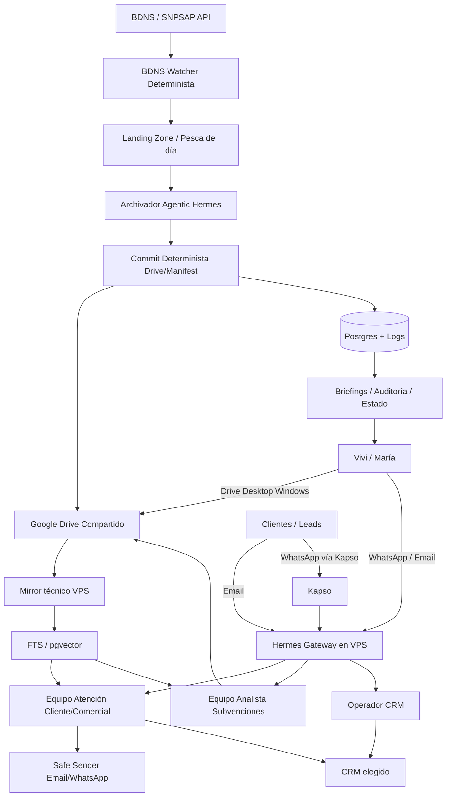
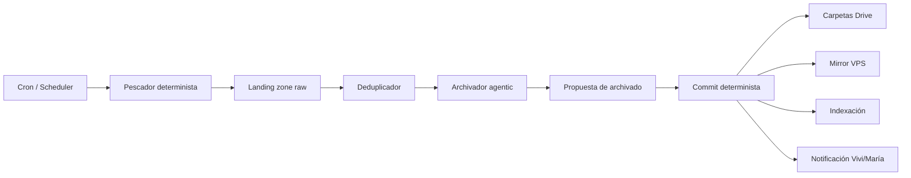
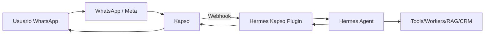

# DClick IA — Contexto de Arquitectura, Decisiones y Diseño del Sistema

> **Uso previsto:** documento de traspaso para iniciar una run del flujo `spec-driving` en `basic-scaffolding`.
>
> **Estado:** borrador técnico/estratégico pre-run, preparado para alimentar al equipo de agentes.
>
> **Audiencia:** agentes de `spec-driving`, equipo técnico Skilland/Reboot, Raúl como PM/CTO del proyecto.
>
> **No es cliente-facing:** contiene jerga técnica, decisiones internas, dudas abiertas, alternativas y referencias de implementación.
>
> **Fecha de preparación:** 2026-06-14.

---

## 0. Cómo usar este documento dentro del loop `spec-driving`

Este documento debe meterse como material bruto dentro de una run aislada de `spec-driving`, no en `00_inbox/`.

Ruta recomendada:

```text
04_outputs/spec-driving/divi-dclick/raw/00_contexto_arquitectura_cto.md
```

`case_id` recomendado:

```text
divi-dclick
```

Configuración inicial recomendada:

```yaml
case_id: "divi-dclick"
artifact_language: "es"
execution_plan_enabled: true
```

Motivo: este caso no debe quedarse solo en preventa; queremos usar el flujo para aterrizar arquitectura, alcance funcional, propuesta y posiblemente plan de ejecución. Si en el momento de lanzar la run todavía solo queremos documentos comerciales/técnicos de preventa, puede dejarse `execution_plan_enabled: false` y activar Stage 06 después.

### Advertencia importante para los agentes

El flujo `spec-driving` usa terminología genérica como `MVP`, `Phase 1` o `Phase 2`. En este proyecto concreto, por decisión estratégica, **no debe usarse framing comercial de fases** ante DClick.

Traducción operativa para la run:

- Donde el flujo diga `MVP`, interpretar como **alcance base del proyecto DClick IA**.
- Donde el flujo diga `Phase 2`, interpretar como **evoluciones funcionales futuras**.
- Donde el flujo diga `fuera de alcance`, mantener como **no incluido en este proyecto** o **dependiente de validación posterior**.
- En documentos cliente-facing, evitar frases tipo “esto solo es una fase 1 incompleta”.
- En documentos técnicos internos sí puede existir una sección de roadmap, siempre que no degrade el valor del proyecto actual.

---

## 1. Resumen ejecutivo interno

DClick / Subvenciones a un Click es un despacho/consultora de gestión de subvenciones, liderado por Vivi/Divi/Dash One y apoyado por María. Trabajan en remoto, cada una desde su equipo Windows, con bajo perfil técnico. Su operativa actual mezcla correo, OneDrive, Excel/Sheets, documentos Word/PDF, IA usada manualmente y newsletters enviadas de forma poco profesional.

La propuesta anterior de Skilland/Reboot planteaba una primera implantación centrada en:

- migrar y ordenar Google Workspace / Drive;
- crear una base documental por subvención;
- diseñar un Equipo IA DClick de analistas bajo demanda;
- preparar CRM/email marketing básico;
- dejar fuera la vigilancia automática BDNS y la atención automática a clientes.

Tras presentar esa visión, el cliente trasladó que sus dolores más intensos son precisamente:

1. **estar siempre pendiente de nuevas subvenciones**, especialmente en Canarias;
2. **atender dudas de clientes y leads de forma rápida**, idealmente de manera automática;
3. **reducir el trabajo repetitivo sin perder criterio ni control operativo**.

Por tanto, se redefine el proyecto como un **sistema propio e integral de automatización IA para el despacho**, con tres naturalezas operativas:

1. **Capa humana/documental:** Google Workspace + Drive Desktop en Windows.
2. **Motores always-on:** radar BDNS/Canarias y atención cliente/comercial por email/WhatsApp.
3. **Equipo IA bajo demanda:** analistas de subvenciones que producen documentación, checklists y contenidos.

La arquitectura elegida gira alrededor de:

- **Hermes** como runtime/cerebro agentic central.
- **VPS** como instalación única del sistema.
- **Google Drive** como casa humana y fuente documental visible.
- **Markdown + metadatos** como base técnica auditable.
- **Postgres + pgvector/FTS ligero** como memoria rápida / índice derivado, no como fuente de verdad.
- **Kapso + Hermes plugin** como vía preferente para WhatsApp.
- **Workers deterministas** para acciones críticas: BDNS, Drive, CRM, envío seguro, campañas, logs.
- **CRM adapter** para poder conectar Twenty, Baserow/NocoDB o GoHighLevel sin rediseñar el sistema.

Frase de arquitectura:

> **Drive es la casa. Hermes es el cerebro. Los workers son las manos. Kapso es la boca de WhatsApp. El índice es la memoria rápida. El CRM es la memoria comercial.**

---

## 2. Principios de diseño aprobados

### 2.1. No vender “fases”

Decisión estratégica:

- No presentar el proyecto como “fase 1” de algo incompleto.
- Presentarlo como un proyecto propio, útil y valioso en sí mismo.
- Puede tener evoluciones funcionales futuras, pero no se debe transmitir que el cliente compra “un trozo”.

Racional:

- DClick es una pyme canaria con sensibilidad al riesgo y a la inversión.
- Si se le presenta una inversión mayor que la primera propuesta, debe sentir que compra un sistema completo y operativo.
- El roadmap futuro se usa como señal de escalabilidad, no como excusa de incompletitud.

### 2.2. No construir un monstruo enterprise

Decisión:

- Diseñar arquitectura seria, pero pragmática.
- Evitar sobredimensionar con Kubernetes, microservicios innecesarios, data lakes o CRM enterprise.
- Usar VPS, Docker/servicios ligeros, Postgres, APIs y repos controlados.

Racional:

- Volumen actual estimado: 10–15 subvenciones al mes.
- Equipo humano: 2 usuarias principales.
- El valor está en automatizar procesos repetitivos y ordenar conocimiento, no en desplegar infraestructura pesada.

### 2.3. Las humanas no deben tocar terminal, Git ni repos

Decisión:

- Vivi y María no interactúan con GitHub, terminal, Codex CLI ni carpetas internas del VPS.
- Su superficie principal de trabajo será Google Drive Desktop en Windows.
- Su superficie principal de conversación será WhatsApp/email.
- Hermes Desktop puede existir como interfaz avanzada opcional tras training, pero no es dependencia crítica.

### 2.4. Autonomía por defecto, escalado por riesgo

Decisión:

- El equipo de atención cliente/comercial debe responder automáticamente por defecto.
- El sistema escala a humano solo cuando detecta riesgo, incertidumbre o necesidad de decisión.

Racional:

- El dolor principal es no tener que revisar manualmente cada correo.
- Si todo queda como borrador pendiente, no resuelve el problema de fondo.
- El diseño debe incluir testing, umbrales, taxonomía de riesgo y logs, no convertir la revisión humana en el flujo normal.

### 2.5. Acciones críticas deterministas

Decisión:

- Hermes decide, conversa, interpreta y orquesta.
- Workers/servicios propios ejecutan acciones estructurales y críticas.

Ejemplos:

- Crear carpetas Drive.
- Escribir manifests.
- Insertar/actualizar CRM.
- Enviar campañas masivas.
- Deduplicar convocatorias.
- Persistir logs.
- Reconstruir índice.

Regla:

> El agente decide significado. El worker ejecuta estructura.

---

## 3. Decisiones de arquitectura aprobadas

### ADR-001 — El proyecto se plantea como sistema propio, no como fase

**Estado:** Aprobada.

**Decisión:** El documento comercial y técnico debe hablar de un sistema propio DClick IA / Equipo IA DClick / Sistema Operativo IA del despacho. No usar framing de fase 1/fase 2 salvo en documentos internos de roadmap.

**Consecuencia:** Los agentes de propuesta comercial deben eliminar lenguaje de “primera fase” salvo que sea sustituido por “alcance inicial del proyecto” o “evoluciones futuras”.

---

### ADR-002 — Hermes como runtime agentic central

**Estado:** Aprobada provisionalmente, pendiente de prueba técnica.

**Decisión:** Hermes será la capa agentic central para:

- conversación por canales vivos;
- orquestación de subagentes/skills;
- tareas background;
- interacción con email/WhatsApp;
- coordinación del equipo de analistas;
- coordinación del equipo de atención cliente/comercial;
- interacción con workers deterministas mediante herramientas controladas.

**Racional:** Queremos comportamiento agentic real, no flujos rígidos tipo n8n para cada caso.

---

### ADR-003 — n8n fuera del core

**Estado:** Aprobada.

**Decisión:** n8n no será el core del sistema. Puede usarse para automatizaciones ad hoc o integraciones puntuales si aparece una necesidad clara, pero no para mapear el flujo principal de atención cliente ni el radar.

**Racional:** n8n obliga a definir flujos rígidos y crece mal cuando el problema es conversacional, contextual y variable.

---

### ADR-004 — VPS como instalación única

**Estado:** Aprobada.

**Decisión:** El sistema vive en un VPS controlado por Skilland/Reboot/DClick, no en los PCs de Vivi/María.

**Componentes en VPS:**

- Hermes Gateway.
- Workers deterministas.
- Repo del sistema.
- Skills/subagentes.
- Postgres.
- Índice FTS/vectorial.
- Logs/auditoría.
- Mirror técnico de Drive.
- Adaptadores externos: BDNS, Drive, Gmail, Kapso, CRM.

**Racional:** Una instalación única evita deriva de versiones, reduce soporte y permite always-on.

---

### ADR-005 — Google Drive como superficie humana y biblioteca visible

**Estado:** Aprobada.

**Decisión:** Google Drive será la biblioteca humana principal. Vivi y María trabajan desde Drive Desktop en Windows, no desde navegador si no quieren.

**Racional:** Necesitan una experiencia parecida a carpetas locales/OneDrive. La adopción depende de que el cambio no parezca técnico.

---

### ADR-006 — Drive canónico + mirror técnico regenerable

**Estado:** Aprobada, pendiente de diseño fino.

**Decisión:** No habrá dos bibliotecas independientes. Habrá:

- Drive como biblioteca humana/canónica.
- VPS como espejo técnico optimizado y regenerable.

**Regla:** Todo output importante debe poder encontrarse en Drive. El mirror y el índice se pueden reconstruir desde Drive + metadata.

**Riesgo:** La sincronización puede convertirse en dolor si se intenta hacer bidireccional total.

**Mitigación:** Gestionar solo carpetas DClick IA controladas por el sistema. Evitar sync general de todo el Drive.

---

### ADR-007 — Markdown como formato operativo base

**Estado:** Aprobada.

**Decisión:** Los outputs de análisis, resumen, checklists, campañas y manifests se producirán principalmente en Markdown, con metadatos JSON cuando proceda.

**Racional:** Markdown es legible, versionable, fácil de procesar por agentes y convertible a otros formatos.

---

### ADR-008 — Índice/RAG ligero derivado, no fuente de verdad

**Estado:** Aprobada provisionalmente.

**Decisión:** Se incorporará una capa ligera de búsqueda semántica/full-text para atención al cliente y recuperación documental, pero no será fuente de verdad.

**Diseño preferido:** Postgres + pgvector + búsqueda full-text de Postgres.

**Alternativas si se complica:** SQLite FTS5, Chroma local, búsqueda literal por archivos Markdown.

**Regla:** Si el índice falla, el sistema degrada; si Drive/Markdown falla, el sistema pierde fuente de verdad.

---

### ADR-009 — BDNS watcher híbrido

**Estado:** Aprobada.

**Decisión:** El radar BDNS/Canarias se construirá como tres piezas:

1. Pescador determinista.
2. Archivador agentic.
3. Commit determinista.

**Racional:** Queremos combinar fiabilidad técnica con flexibilidad semántica.

---

### ADR-010 — Atención cliente/comercial autónoma por defecto

**Estado:** Aprobada conceptualmente, pendiente de mapa funcional y límites.

**Decisión:** El sistema debe responder automáticamente en email/WhatsApp cuando el caso sea seguro o suficientemente claro.

**Escala a humano si:**

- hay datos sensibles;
- hay decisión jurídica/fiscal/administrativa;
- el cliente exige compromiso económico o legal;
- el sistema no encuentra fuente suficiente;
- hay que tramitar, no solo informar;
- hay que revisar documentación específica;
- hay que resolver queja grave;
- el tono del cliente muestra enfado, urgencia o riesgo reputacional;
- la respuesta podría comprometer al despacho.

---

### ADR-011 — Campañas con IA, envío masivo con confirmación humana

**Estado:** Aprobada.

**Decisión:** El sistema puede preparar campañas, segmentar y redactar. El envío masivo requiere aprobación humana.

**Racional:** Reducir riesgo RGPD, reputación de dominio, bajas/unsubscribe y errores en comunicación masiva.

---

### ADR-012 — WhatsApp preferentemente vía Kapso + Hermes plugin

**Estado:** Aprobada provisionalmente, pendiente de validación técnica/coste.

**Decisión:** Kapso se convierte en vía preferente para WhatsApp por delante de Baileys, siempre que la prueba técnica y los costes cuadren.

**Racional:** Kapso tiene plugin específico para Hermes, API/developer tooling, skills, ejemplos de soporte y broadcasts. Evita depender directamente de un bridge informal tipo WhatsApp Web para producción.

---

### ADR-013 — CRM no es cerebro, es memoria comercial

**Estado:** Aprobada.

**Decisión:** El CRM no orquesta la IA. El CRM guarda contactos, oportunidades, estados, notas, tareas y memoria comercial.

**Opciones:**

- Twenty: open source, CRM real, self-hostable, API REST/GraphQL.
- Baserow/NocoDB: spreadsheet-database, más natural para usuarias que vienen de Excel/Sheets.
- GoHighLevel: SaaS más bonito/comercial, pero más caro y ya no imprescindible para IA.

---

### ADR-014 — CRM adapter agnóstico

**Estado:** Aprobada.

**Decisión:** Construir una capa `crm_adapter` con contrato propio. El sistema llama a nuestro contrato; el adapter traduce a Twenty, Baserow, NocoDB o GoHighLevel.

**Racional:** Evita lock-in y permite presentar alternativas al cliente.

---

### ADR-015 — Logs, auditoría y trazabilidad obligatorios

**Estado:** Aprobada.

**Decisión:** Toda acción relevante debe quedar registrada:

- mensaje recibido;
- clasificación;
- fuentes consultadas;
- decisión de respuesta/escalado;
- respuesta enviada;
- archivos creados/modificados;
- CRM actualizado;
- errores;
- campañas preparadas/enviadas;
- jobs BDNS.

---

## 4. Arquitectura de alto nivel



---

## 5. Componentes del sistema

### 5.1. DClick IA Server / VPS

#### Responsabilidad

El VPS es la instalación única del sistema. Aloja el runtime agentic, los workers, la base de datos, el mirror técnico, los logs, el índice y los adaptadores externos.

#### Componentes previstos

```text
/srv/divi-dclick/
  app/
    hermes/
    workers/
    services/
    skills/
    agents/
    adapters/
  knowledge-mirror/
  inbox/
    bdns/
    email/
    whatsapp/
  outputs/
  logs/
  config/
  secrets/                 # o gestor de secrets externo; no commitear
  docker-compose.yml
```

#### Servicios posibles

- `hermes-gateway`
- `bdns-watcher`
- `drive-sync-worker`
- `knowledge-indexer`
- `crm-adapter`
- `safe-sender`
- `campaign-dispatcher`
- `daily-briefing-worker`
- `postgres`
- `backup-worker`

#### Criterios de diseño

- Un único repo privado controla el sistema.
- Deploy reproducible.
- Backups del Postgres y manifests.
- Separación de secrets.
- Logs rotados.
- Healthchecks básicos.
- Capacidad de reiniciar workers sin perder estado.

---

### 5.2. Google Workspace / Drive

#### Responsabilidad

Google Workspace es la superficie de trabajo humana y el almacén visible del despacho.

#### Necesidades específicas del cliente

- Vivi y María trabajan en remoto.
- Ambas usan Windows.
- Prefieren trabajar desde aplicación local, no navegador.
- Son usuarias no técnicas.
- Necesitan una experiencia parecida a OneDrive/carpeta local.
- Se debe hacer mini training de Drive Desktop.

#### Estructura propuesta de Drive

```text
DClick IA - Subvenciones/
  00_Radar_Subvenciones/
    Nuevas_detectadas/
    Pendientes_revision/
    Descartadas/
    Relevantes/
  01_Subvenciones_Activas/
    2026_Nombre_Subvencion/
      00_Bases_y_Convocatoria/
      01_Analisis_Interno/
      02_Checklists/
      03_Contenido_Comercial/
      04_Clientes_y_Ofertas/
      05_Historico_y_Comparativas/
      99_Metadata/
  02_Clientes_y_Expedientes/
  03_Campañas_y_Comunicaciones/
  04_Plantillas/
  05_Manual_DClick_IA/
  99_Admin_Sistema/
```

#### Reglas

- Las humanas pueden leer/editar outputs finales.
- El sistema puede crear carpetas y documentos en zonas controladas.
- El sistema no debe operar sobre todo el Drive global.
- Las carpetas gobernadas por IA deben estar claramente delimitadas.
- `99_Metadata` puede estar oculto o explicado como zona técnica.

---

### 5.3. Mirror técnico Drive ↔ VPS

#### Responsabilidad

El mirror técnico permite que Hermes y los workers trabajen rápido sin depender de recorrer Drive en cada interacción.

#### Principio

No hay dos fuentes de verdad. Hay:

- Drive como biblioteca humana/canónica.
- VPS como mirror técnico regenerable.

#### Estructura mirror

```text
/srv/divi-dclick/knowledge-mirror/
  subsidies/
    2026_nombre_subvencion/
      source_files/
      markdown/
      outputs/
      metadata.json
      drive_manifest.json
      index_status.json
  customers/
  campaigns/
  global_templates/
```

#### `drive_manifest.json` mínimo

```json
{
  "drive_folder_id": "...",
  "drive_path": "DClick IA - Subvenciones/01_Subvenciones_Activas/2026_Nombre_Subvencion",
  "local_path": "/srv/divi-dclick/knowledge-mirror/subsidies/2026_nombre_subvencion",
  "last_sync_at": "2026-06-14T10:00:00Z",
  "files": [
    {
      "drive_file_id": "...",
      "drive_name": "bases.pdf",
      "local_path": "source_files/bases.pdf",
      "mime_type": "application/pdf",
      "sha256": "...",
      "modified_time": "...",
      "indexed": true,
      "source_type": "official_basis"
    }
  ]
}
```

#### Flujo de sincronización

1. Worker detecta cambios en Drive dentro de carpetas gobernadas.
2. Descarga o exporta cambios al mirror.
3. Calcula hash/checksum.
4. Actualiza manifest.
5. Lanza reindexación si procede.
6. Registra log.

#### Riesgo principal

Sincronización bidireccional caótica.

#### Mitigación

- Evitar edición simultánea de archivos técnicos.
- Mantener outputs finales como documentos visibles.
- Usar manifests como fuente de estado técnico.
- En conflicto, priorizar Drive como canónico salvo outputs en curso.

---

### 5.4. Knowledge layer: Markdown + índice ligero

#### Responsabilidad

Permitir que agentes de análisis y atención consulten conocimiento de subvenciones de forma fiable.

#### Capas

1. **Documentos fuente:** PDFs, bases, convocatorias, anexos, emails, históricos.
2. **Markdown normalizado:** resúmenes, checklists, outputs, comparativas.
3. **Metadatos:** fechas, órgano, ID BDNS, sectores, tags, estado, Drive IDs.
4. **Índice full-text:** búsqueda literal y por términos.
5. **Índice vectorial:** búsqueda semántica para preguntas naturales.
6. **Logs/auditoría:** qué se consultó y por qué.

#### Diseño técnico preferido

- Postgres como base principal.
- `pgvector` como extensión para embeddings.
- Full-text search de Postgres para búsqueda literal.
- Tabla `documents`.
- Tabla `document_chunks`.
- Tabla `embeddings` o columna vectorial en chunks.

#### Modelo conceptual

```sql
subsidies
source_documents
analysis_outputs
document_chunks
contacts
conversations
messages
actions_log
campaigns
crm_sync_events
jobs
```

#### Regla de degradación

- Si no hay índice: Hermes puede leer Markdown directo.
- Si no hay Markdown: no debe inventar desde memoria.
- Si no hay fuentes suficientes: escalar o pedir información.

---

## 6. Motor 1 — Radar BDNS/Canarias always-on

### 6.1. Objetivo

Detectar periódicamente nuevas subvenciones relevantes para DClick, especialmente Canarias, sin que Vivi/María tengan que revisar manualmente la BDNS todos los días.

### 6.2. Fuente principal

BDNS / SNPSAP, vía API REST/JSON o librería `bdns-fetch` si resulta suficiente.

### 6.3. Arquitectura interna



### 6.4. Pescador determinista

Responsabilidades:

- Ejecutarse cada X horas o diariamente.
- Consultar BDNS/API.
- Filtrar por criterios configurables.
- Descargar metadatos.
- Descargar PDFs si están disponibles.
- Guardar todo en landing zone.
- Registrar errores.

Criterios iniciales posibles:

- ámbito territorial Canarias;
- órganos del Gobierno de Canarias;
- cabildos;
- ayuntamientos relevantes;
- sectores recurrentes de clientes DClick;
- keywords: digitalización, modernización, comercio, eficiencia energética, autónomos, pymes, industria, turismo, innovación, empleo, formación, sostenibilidad;
- fechas de convocatoria/publicación;
- exclusiones explícitas.

### 6.5. Landing zone

```text
/srv/divi-dclick/inbox/bdns/2026-06-14/
  raw_json/
  pdfs/
  fetch_log.json
  candidates.jsonl
```

### 6.6. Deduplicación

Claves posibles:

- número de convocatoria BDNS;
- ID de convocatoria;
- órgano;
- título normalizado;
- fecha;
- URL/PDF hash;
- similitud de texto.

Estados:

- `new`
- `already_seen`
- `updated`
- `duplicate_candidate`
- `discarded_by_filter`
- `needs_review`

### 6.7. Archivador agentic

Responsabilidad:

- Leer la pesca del día.
- Interpretar relevancia real para DClick.
- Proponer nombre de carpeta.
- Proponer categoría.
- Proponer tags.
- Proponer destino Drive.
- Proponer si merece preanálisis.
- Generar resumen corto para notificación.

No debe ejecutar directamente estructura en Drive. Debe producir una propuesta validable.

Salida esperada:

```json
{
  "candidate_id": "bdns_123456",
  "recommended_action": "create_subsidy_folder",
  "relevance": "high",
  "confidence": 0.86,
  "proposed_folder_name": "2026_Modernizacion_Comercio_Canarias",
  "tags": ["canarias", "comercio", "pymes", "inversion"],
  "reason": "Convocatoria regional potencialmente relevante para clientes pyme de DClick.",
  "requires_human_review": false
}
```

### 6.8. Commit determinista

Responsabilidades:

- Validar JSON/schema del archivador.
- Crear carpeta en Drive.
- Copiar PDFs/metadatos.
- Crear `metadata.json`.
- Actualizar mirror.
- Lanzar indexación.
- Notificar a Vivi/María.

### 6.9. Notificaciones

Canales:

- WhatsApp a Vivi/María.
- Email interno.
- Resumen diario/semanal.

Ejemplo:

```text
Nueva subvención detectada y archivada:

2026_Modernizacion_Comercio_Canarias
Relevancia: alta
Motivo: ayudas para pymes/comercio en Canarias.
Documentación guardada en Drive.

Acciones disponibles:
1. Lanzar análisis completo.
2. Preparar campaña.
3. Marcar como no relevante.
```

---

## 7. Motor 2 — Equipo IA Analista bajo demanda

### 7.1. Objetivo

Procesar una subvención concreta y generar un paquete de outputs reutilizables para el despacho.

### 7.2. Interacción humana

Interfaz principal:

- WhatsApp.
- Email.

Interfaz opcional:

- Hermes Desktop tras training.

Ejemplos de instrucciones humanas:

```text
Procesa la subvención de modernización comercial y genera el paquete estándar.
```

```text
Haz comparativa con la convocatoria del año pasado si hay histórico.
```

```text
Prepara newsletter y post web para esta subvención, orientado a autónomos y pymes.
```

### 7.3. Ejecución

- Hermes recibe la petición.
- Identifica la subvención/folder.
- Lanza tarea background.
- Usa el mirror/índice/Markdown.
- Produce outputs.
- Escribe resultados en Drive.
- Notifica finalización.

### 7.4. Outputs estándar iniciales

1. Resumen técnico interno.
2. Checklist de requisitos.
3. Checklist de documentación para solicitud.
4. Checklist de documentación para justificación.
5. Puntos clave / alertas / letra pequeña.
6. Resumen comercial para web.
7. Newsletter.
8. Post para redes sociales.

Estos 8 outputs vienen del mapeado original de necesidades de Divi y siguen siendo el paquete base del equipo analista.

### 7.5. Subagentes candidatos

#### Analista de subvenciones

Extrae:

- objeto;
- beneficiarios;
- requisitos;
- gastos subvencionables;
- cuantías;
- intensidad;
- plazos;
- criterios de valoración;
- exclusiones;
- riesgos.

#### Gestor documental

Produce:

- checklist solicitud;
- checklist justificación;
- documentación obligatoria;
- documentación opcional;
- notas para clientes.

#### Analista de puntos críticos

Detecta:

- letra pequeña;
- incompatibilidades;
- plazos sensibles;
- exclusiones;
- riesgos de interpretación;
- zonas donde se requiere criterio humano.

#### Analista comparativo

Compara convocatoria actual con ediciones anteriores si hay histórico.

#### Redactor comercial

Convierte análisis técnico en:

- newsletter;
- post web;
- mensaje WhatsApp;
- texto RRSS;
- CTA comercial.

#### Gestor de conocimiento operativo

Organiza:

- outputs;
- aprendizajes;
- criterios recurrentes;
- resumen para RAG/índice;
- actualización de histórico.

### 7.6. Principios de seguridad

- No emitir dictamen jurídico definitivo.
- No garantizar concesión.
- No sustituir revisión humana si hay dudas.
- Citar fuentes internas siempre que sea posible.
- Separar análisis técnico de texto comercial.

---

## 8. Motor 3 — Equipo Atención Cliente/Comercial always-on

### 8.1. Objetivo

Atender de forma autónoma la mayoría de dudas entrantes por email/WhatsApp, precalificar leads, resolver dudas recurrentes, actualizar CRM y preparar campañas.

### 8.2. Capacidades aprobadas

1. Atención entrante autónoma.
2. Precalificación comercial.
3. Soporte cliente ligero/inteligente.
4. Campañas sobre nuevas subvenciones.
5. CRM sync.
6. Briefings y control.

### 8.3. Atención entrante autónoma

Flujo:

1. Llega email/WhatsApp.
2. Hermes identifica remitente.
3. Clasifica intención.
4. Recupera contexto documental/CRM.
5. Decide responder, preguntar, escalar o no responder.
6. Envía respuesta si procede.
7. Registra log.
8. Actualiza CRM.

Tipos de remitente:

- lead nuevo;
- cliente conocido;
- cliente activo con expediente;
- proveedor;
- administración;
- spam/no relacionado.

Tipos de intención:

- pregunta sobre subvención concreta;
- pregunta genérica sobre ayudas;
- solicitud de presupuesto;
- envío de documentación;
- consulta sobre expediente activo;
- duda sobre plazos;
- baja/newsletter;
- queja/incidencia;
- pregunta fuera de alcance.

### 8.4. Precalificación comercial

Objetivo:

- Convertir leads no estructurados en información útil.
- Recomendar siguiente paso.
- Derivar a cita/oferta/formulario cuando proceda.

Datos a pedir:

- actividad;
- isla/municipio;
- forma jurídica;
- tamaño;
- inversión prevista;
- tipo de proyecto;
- urgencia;
- subvención de interés;
- si ya es cliente;
- datos mínimos para presupuesto.

Resultado:

- contacto creado/actualizado en CRM;
- oportunidad si procede;
- etiqueta de interés;
- recomendación;
- CTA.

### 8.5. Soporte cliente ligero

Casos que puede resolver:

- confirmar recepción;
- explicar próximos pasos;
- recordar documentación pendiente;
- indicar dónde encontrar información;
- resolver dudas generales sobre requisitos/plazos si hay fuente clara;
- pedir datos faltantes;
- mantener informado al cliente.

Casos que debe escalar:

- decisión de elegibilidad compleja;
- interpretación jurídica/fiscal;
- documentación sensible;
- errores o reclamaciones;
- quejas;
- compromisos de precio/plazo/tramitación;
- dudas no cubiertas por fuentes;
- expediente con riesgo.

### 8.6. Campañas sobre nuevas subvenciones

Funciones:

- detectar subvención relevante;
- proponer segmento de contactos;
- preparar asunto;
- preparar newsletter;
- preparar WhatsApp template/message;
- preparar CTA;
- preparar landing/formulario si aplica;
- guardar campaña como borrador;
- pedir aprobación humana para envío masivo;
- registrar resultados.

Regla:

- Comunicación uno-a-uno entrante: puede responder automáticamente.
- Campaña masiva outbound: requiere aprobación humana.

### 8.7. CRM sync

Acciones:

- crear contacto;
- actualizar contacto;
- crear oportunidad;
- cambiar estado;
- añadir nota;
- añadir tag;
- registrar subvención asociada;
- crear tarea;
- marcar escalado humano;
- registrar campaña.

### 8.8. Briefings y control

Briefing diario:

- nuevas subvenciones detectadas;
- mensajes respondidos;
- leads nuevos;
- clientes atendidos;
- casos escalados;
- campañas pendientes;
- errores;
- próximos pasos recomendados.

Briefing semanal:

- resumen actividad;
- oportunidades calientes;
- campañas enviadas;
- rendimiento;
- incidencias;
- mejoras sugeridas.

---

## 9. WhatsApp con Kapso + Hermes

### 9.1. Decisión

Usar Kapso como opción preferente para integrar WhatsApp con Hermes, pendiente de prueba técnica y coste.

### 9.2. Componentes Kapso relevantes

- Documentación general de Kapso.
- Plugin `gokapso/hermes-agent-plugin`.
- Skills `gokapso/agent-skills`.
- Ejemplo `whatsapp-support-agent`.
- Ejemplo `whatsapp-broadcasts-example`.
- Cliente `whatsapp-cloud-api-js`.

### 9.3. Razones para preferir Kapso

- Integración explícita con Hermes.
- Webhooks para mensajes entrantes.
- Respuestas por WhatsApp Cloud API/proxy.
- Skills para agents.
- Ejemplos de soporte y broadcasts.
- Mejor ruta que Baileys/WhatsApp Web para producción.

### 9.4. Patrón técnico previsto



### 9.5. Configuración conceptual

Variables esperadas:

```text
KAPSO_API_KEY
KAPSO_WEBHOOK_SECRET
KAPSO_PHONE_NUMBER_ID
KAPSO_HOME_CHANNEL
KAPSO_ALLOWED_USERS
KAPSO_WEBHOOK_URL
```

### 9.6. Seguridad

- Número dedicado para DClick IA.
- Allowlist para usuarios internos si se usa como canal de control.
- Para clientes externos, separar modo cliente de modo admin.
- No exponer tools de administración a usuarios externos.
- Logs de cada respuesta.
- Escalado ante riesgo.

### 9.7. Broadcasts

Kapso tiene ejemplo de broadcasts. En DClick se usaría para campañas, pero con aprobación humana.

Estados de campaña:

- `draft`
- `pending_approval`
- `approved`
- `scheduled`
- `sent`
- `failed`
- `cancelled`

---

## 10. Email

### 10.1. Decisión

Email será canal principal de atención cliente, junto con WhatsApp.

### 10.2. Cuenta recomendada

Crear cuenta dedicada:

```text
ia@subvencionesaunclick.com
```

o similar.

Alternativa:

- usar cuenta de consultas general con reglas/labels.
- configurar reenvío/alias hacia la cuenta IA.

### 10.3. Reglas

- No dar a Hermes acceso irrestricto a todo el correo histórico sin necesidad.
- Etiquetar o enrutar lo que debe atender.
- Separar internos vs clientes.
- Registrar hilos.
- Respetar bajas/unsubscribe.
- Escalar si hay adjuntos sensibles o trámites.

### 10.4. Funciones

- leer mensajes nuevos;
- clasificar;
- responder;
- pedir más datos;
- adjuntar documentos si procede;
- registrar en CRM;
- notificar escalado.

---

## 11. CRM

### 11.1. Decisión general

El CRM no debe ser el cerebro del sistema. Debe ser memoria comercial y superficie visual.

### 11.2. Contrato `crm_adapter`

Hermes y los agents llaman a un contrato común:

```text
crm.lookup_contact
crm.create_contact
crm.update_contact
crm.create_opportunity
crm.update_opportunity_stage
crm.add_note
crm.add_tag
crm.create_task
crm.link_subsidy_interest
crm.log_conversation
crm.get_active_cases_for_contact
```

El adapter traduce a la API real.

### 11.3. Opciones CRM

#### Twenty

Pros:

- CRM real.
- Open source/self-hostable.
- API REST/GraphQL generada por schema.
- Custom objects.
- Control técnico.

Contras:

- Interfaz puede resultar menos amable.
- Requiere despliegue y mantenimiento.

#### Baserow

Pros:

- Mentalidad spreadsheet/database.
- Similar a su forma actual de trabajar en Excel/Sheets.
- API REST generada.
- Permisos por tokens.

Contras:

- No es CRM nativo.
- Hay que diseñar tablas/vistas de pipeline.

#### NocoDB

Pros:

- Similar a Baserow.
- REST APIs.
- Puede servir como panel operacional sencillo.

Contras:

- No es CRM nativo.
- Hay que modelar pipeline.

#### GoHighLevel

Pros:

- SaaS comercial más completo.
- CRM, oportunidades, workflows, messaging, campañas.
- Interfaz más vendible.

Contras:

- Coste.
- Lock-in.
- Ya no se necesita como cerebro IA.
- API y features pueden depender de plan.

### 11.4. Recomendación actual

Presentar al cliente dos/tres rutas:

1. **Ruta controlada/open source:** Twenty.
2. **Ruta spreadsheet-friendly barata:** Baserow/NocoDB.
3. **Ruta SaaS bonita:** GoHighLevel.

El sistema DClick IA debe funcionar con cualquiera mediante adapter.

---

## 12. Seguridad, RGPD y control

### 12.1. Riesgos

- Datos fiscales/personales.
- Documentación de clientes.
- Expedientes de subvenciones.
- Respuestas automáticas incorrectas.
- Envíos masivos no deseados.
- Riesgo reputacional.
- Acceso excesivo de agentes a herramientas.
- WhatsApp/email expuestos a clientes externos.

### 12.2. Principios

- Mínimo privilegio.
- Cuenta técnica dedicada.
- Separación entre canales internos y externos.
- Allowlist para comandos internos.
- Tools seguras y específicas.
- No terminal libre para clientes.
- Logs y auditoría.
- Escalado por riesgo.
- Confirmación humana para campañas masivas.

### 12.3. Taxonomía de riesgo para respuestas

#### Riesgo bajo — puede responder automático

- Confirmación de recepción.
- Información general ya documentada.
- Pedir datos faltantes.
- Explicar próximos pasos estándar.
- Responder dudas simples con fuente clara.

#### Riesgo medio — puede responder con cuidado o pedir confirmación

- Elegibilidad probable.
- Interpretación de requisitos con matices.
- Comparaciones entre ayudas.
- Recomendaciones comerciales.
- Solicitud de presupuesto inicial.

#### Riesgo alto — escalar humano

- Dictamen definitivo.
- Documentación sensible.
- Tramitación en curso.
- Quejas.
- Reclamaciones.
- Compromisos económicos.
- Respuestas con impacto jurídico/fiscal.
- Incertidumbre documental.

### 12.4. Mensajes de escalado

Ejemplo:

```text
He revisado tu consulta y requiere validación del equipo porque afecta a documentación específica de tu expediente. Se lo paso a Vivi/María para que lo revisen y te respondan con criterio.
```

---

## 13. Logs y auditoría

### 13.1. Eventos a registrar

- `bdns_fetch_started`
- `bdns_fetch_completed`
- `bdns_candidate_detected`
- `bdns_candidate_archived`
- `drive_folder_created`
- `drive_file_synced`
- `document_indexed`
- `message_received`
- `intent_classified`
- `rag_query_executed`
- `response_sent`
- `case_escalated`
- `crm_contact_created`
- `crm_opportunity_updated`
- `campaign_draft_created`
- `campaign_approved`
- `campaign_sent`
- `agent_task_started`
- `agent_task_completed`
- `error`

### 13.2. Action log schema mínimo

```json
{
  "event_id": "uuid",
  "event_type": "message_received",
  "timestamp": "2026-06-14T10:00:00Z",
  "actor_type": "customer|internal_user|agent|worker|system",
  "actor_id": "...",
  "channel": "email|whatsapp|drive|bdns|crm",
  "object_type": "message|subsidy|contact|campaign|file|job",
  "object_id": "...",
  "summary": "Mensaje recibido de lead preguntando por subvención de comercio.",
  "metadata": {},
  "risk_level": "low|medium|high",
  "decision": "responded|escalated|ignored|queued",
  "sources_used": []
}
```

---

## 14. Workflows clave

### 14.1. Nueva subvención detectada

1. BDNS watcher corre.
2. Encuentra convocatoria potencial.
3. Descarga JSON/PDFs.
4. Deduplica.
5. Archivador agentic clasifica.
6. Commit worker crea carpeta Drive.
7. Se genera metadata.
8. Se indexa.
9. Se notifica a Vivi/María.
10. El sistema ofrece acciones.

### 14.2. Lanzar análisis completo

1. Vivi/María piden por WhatsApp: “Lanza análisis completo”.
2. Hermes identifica subvención.
3. Crea background task.
4. Equipo analista lee fuentes.
5. Genera outputs.
6. Escribe outputs en Drive.
7. Actualiza índice.
8. Notifica finalización.

### 14.3. Lead nuevo pregunta por ayudas

1. Entra mensaje.
2. Hermes detecta lead nuevo.
3. Pregunta datos mínimos si faltan.
4. Busca subvenciones relevantes.
5. Responde con orientación general.
6. Sugiere cita/formulario/presupuesto.
7. Crea contacto y oportunidad.
8. Registra conversación.

### 14.4. Cliente activo pregunta por expediente

1. Entra mensaje.
2. Hermes identifica cliente.
3. Busca expediente/estado/documentos.
4. Si es consulta simple, responde.
5. Si requiere decisión o documentación sensible, escala.
6. Actualiza CRM y log.

### 14.5. Campaña por nueva subvención

1. Nueva subvención relevante.
2. Usuario pide: “Prepara campaña”.
3. Sistema propone segmento.
4. Redacta email/WhatsApp/web.
5. Deja campaña en borrador.
6. Pide aprobación humana.
7. Si se aprueba, dispatcher envía.
8. Registra resultados.

### 14.6. Briefing diario

1. Worker recopila eventos del día.
2. Resume actividad.
3. Lista casos escalados.
4. Lista oportunidades nuevas.
5. Lista campañas pendientes.
6. Envía a Vivi/María.

---

## 15. Agentes y skills candidatos

### 15.1. Orquestador DClick IA

Responsabilidad:

- Entender peticiones internas.
- Enrutar a equipo analista, atención cliente, radar, CRM o campañas.
- Mantener control de estado.

### 15.2. Radar Archivist Agent

Responsabilidad:

- Clasificar pesca BDNS.
- Proponer relevancia.
- Proponer carpeta/tags.
- Preparar resumen.

### 15.3. Subsidy Analysis Crew

Subagentes:

- Analista técnico.
- Gestor documental.
- Analista de riesgos.
- Comparador histórico.
- Redactor comercial.
- Gestor de conocimiento.

### 15.4. Customer Care Agent

Responsabilidad:

- Atender dudas entrantes.
- Recuperar contexto.
- Responder o escalar.
- Mantener tono profesional y cercano.

### 15.5. Sales Prequalification Agent

Responsabilidad:

- Convertir lead difuso en oportunidad estructurada.
- Pedir datos clave.
- Recomendar CTA.

### 15.6. Campaign Agent

Responsabilidad:

- Preparar campañas.
- Segmentar.
- Redactar.
- Proponer envío.
- No enviar masivamente sin aprobación.

### 15.7. CRM Operator Agent

Responsabilidad:

- Usar `crm_adapter`.
- Crear/actualizar contactos.
- Crear oportunidades.
- Añadir notas/tareas/tags.

### 15.8. Safety / Escalation Agent

Responsabilidad:

- Revisar riesgo de respuestas.
- Decidir escalado.
- Bloquear acciones inseguras.

### 15.9. Knowledge Librarian Agent

Responsabilidad:

- Mantener Markdown.
- Actualizar metadatos.
- Controlar indexación.
- Detectar documentos faltantes.

---

## 16. Tool contracts internos

### 16.1. BDNS tools

```text
bdns.search_new_calls(filters) -> candidates
bdns.fetch_call_details(call_id) -> details
bdns.download_documents(call_id) -> files
bdns.mark_seen(call_id)
bdns.get_candidate_status(call_id)
```

### 16.2. Drive tools

```text
drive.create_subsidy_folder(metadata) -> folder_ids
drive.upload_file(local_path, folder_id) -> drive_file_id
drive.write_markdown(path_or_folder, filename, content) -> drive_file_id
drive.read_file(file_id) -> content
drive.sync_folder(folder_id) -> sync_report
drive.get_folder_manifest(folder_id) -> manifest
```

### 16.3. Knowledge tools

```text
knowledge.index_document(document_id)
knowledge.search(query, filters) -> sources
knowledge.search_subsidy(subsidy_id, query) -> sources
knowledge.get_subsidy_summary(subsidy_id)
knowledge.rebuild_index(scope)
```

### 16.4. CRM tools

```text
crm.lookup_contact(email_or_phone)
crm.create_contact(data)
crm.update_contact(contact_id, data)
crm.create_opportunity(data)
crm.update_opportunity(opportunity_id, data)
crm.add_note(entity_id, note)
crm.add_tag(entity_id, tag)
crm.create_task(data)
crm.log_conversation(data)
```

### 16.5. Messaging tools

```text
email.send_reply(thread_id, body, attachments?)
email.send_new(to, subject, body, attachments?)
whatsapp.send_message(to, body, media?)
whatsapp.send_template(to, template_id, variables)
whatsapp.prepare_broadcast(campaign)
whatsapp.send_approved_broadcast(campaign_id)
```

### 16.6. Safety tools

```text
safety.classify_risk(message, draft, sources) -> risk
safety.requires_human_approval(action) -> boolean
human.escalate_case(summary, channel, priority)
human.request_campaign_approval(campaign_id)
```

---

## 17. Datos y entidades

### 17.1. Subsidy

```json
{
  "id": "sub_2026_modernizacion_comercio_canarias",
  "bdns_id": "...",
  "title": "...",
  "organism": "...",
  "territory": "Canarias",
  "publication_date": "...",
  "deadline": "...",
  "status": "detected|archived|analyzed|campaign_ready|active|discarded",
  "relevance": "high|medium|low",
  "tags": [],
  "drive_folder_id": "...",
  "mirror_path": "..."
}
```

### 17.2. Contact

```json
{
  "id": "contact_...",
  "crm_id": "...",
  "name": "...",
  "email": "...",
  "phone": "...",
  "type": "lead|client|provider|admin",
  "company": "...",
  "tags": [],
  "active_cases": []
}
```

### 17.3. Conversation

```json
{
  "id": "conv_...",
  "channel": "email|whatsapp",
  "contact_id": "...",
  "thread_id": "...",
  "status": "open|responded|escalated|closed",
  "intent": "subsidy_question|prequalification|active_case|documents|complaint|other",
  "risk_level": "low|medium|high",
  "related_subsidies": [],
  "messages": []
}
```

### 17.4. Campaign

```json
{
  "id": "camp_...",
  "subsidy_id": "...",
  "channel": "email|whatsapp|both",
  "segment": "...",
  "status": "draft|pending_approval|approved|scheduled|sent|failed|cancelled",
  "subject": "...",
  "body": "...",
  "cta": "...",
  "approved_by": null,
  "approved_at": null
}
```

---

## 18. Referencias técnicas externas

### 18.1. Hermes

- Web comunitaria: https://hermes-ai.net/
- Quickstart: https://hermes-ai.net/docs/quickstart/
- Docs oficiales enlazadas desde la web comunitaria: https://hermes-agent.nousresearch.com/docs

Notas técnicas extraídas:

- Hermes puede correr en Linux/macOS/WSL2.
- Tiene gateway de mensajería.
- Soporta skills, herramientas, MCP, cron/scheduled automations y backends de terminal/sandbox.
- Puede ejecutarse en servidor/VPS.
- Debe configurarse con herramientas seguras y permisos limitados.

### 18.2. Kapso

- Docs: https://docs.kapso.ai/docs/introduction
- Hermes plugin: https://github.com/gokapso/hermes-agent-plugin
- Agent skills: https://github.com/gokapso/agent-skills
- Support agent example: https://github.com/gokapso/whatsapp-support-agent
- Broadcasts example: https://github.com/gokapso/whatsapp-broadcasts-example
- WhatsApp Cloud API JS client: https://github.com/gokapso/whatsapp-cloud-api-js

Notas:

- Kapso tiene integración explícita para Hermes.
- El plugin convierte webhooks de WhatsApp en eventos de Hermes.
- El plugin requiere API key, número conectado, webhook HTTPS y allowlist recomendada.
- Hay skills para integrar, automatizar y observar WhatsApp.
- Hay ejemplo de broadcasts para campañas.

### 18.3. BDNS / SNPSAP

- Catálogo datos.gob: https://datos.gob.es/es/catalogo/e05250001-base-de-datos-nacional-de-subvenciones
- API Swagger: https://www.infosubvenciones.es/bdnstrans/doc/swagger
- bdns-fetch: https://github.com/cruzlorite/bdns-fetch

Notas:

- BDNS/SNPSAP ofrece API REST en JSON.
- El acceso API permite consultas periódicas sin intervención humana.
- `bdns-fetch` implementa API oficial y ofrece cliente Python/CLI.

### 18.4. Google Drive API

- Crear carpetas: https://developers.google.com/workspace/drive/api/guides/folder
- Gestionar cambios: https://developers.google.com/workspace/drive/api/guides/manage-changes

Notas:

- Las carpetas son archivos con MIME type `application/vnd.google-apps.folder`.
- `files.create()` permite crear carpetas.
- La API permite procesar cambios con tokens y `changes.list`/`changes.watch`.

### 18.5. Índice / búsqueda

- pgvector: https://github.com/pgvector/pgvector
- PostgreSQL Full Text Search: https://www.postgresql.org/docs/current/textsearch.html

Notas:

- pgvector permite búsqueda vectorial dentro de Postgres.
- PostgreSQL incluye full-text search nativo.
- Esto permite evitar una base vectorial adicional en el primer diseño.

### 18.6. CRM

Twenty:

- https://docs.twenty.com/developers/extend/api

Baserow:

- https://baserow.io/user-docs/database-api

NocoDB:

- https://nocodb.com/docs/product-docs/developer-resources/rest-apis

GoHighLevel:

- https://help.gohighlevel.com/support/solutions/articles/48001060529-highlevel-api-documentation

---

## 19. Preguntas abiertas para resolver antes o durante la run

### 19.1. Google Workspace / Drive

- ¿DClick ya tiene Google Workspace operativo o hay que contratar/configurar?
- ¿Qué dominio usarán?
- ¿Hay que migrar email desde Hostalia?
- ¿Qué volumen de archivos hay en OneDrive?
- ¿Qué carpetas actuales hay que respetar?
- ¿Quién será owner/admin del Shared Drive?
- ¿Qué permisos exactos tendrán Vivi, María y la cuenta IA?

### 19.2. BDNS

- Filtros exactos de relevancia.
- Keywords principales.
- Organismos prioritarios.
- Qué hacer con subvenciones nacionales que aplican a Canarias.
- Frecuencia de consulta.
- Qué nivel de preanálisis automático lanzar tras detección.

### 19.3. Atención cliente

- Cuenta/canal de entrada.
- Tipos de preguntas recurrentes.
- Mensajes que hoy consumen más tiempo.
- Tono deseado.
- Qué puede responder la IA sin validación.
- Qué siempre debe escalar.
- Si los clientes aceptan WhatsApp como canal.

### 19.4. WhatsApp / Kapso

- Coste real de Kapso + Meta.
- Número dedicado.
- Verificación Meta/Business.
- Templates necesarios.
- Límites de ventana de 24 horas.
- Política de opt-in.

### 19.5. CRM

- ¿Prefieren interfaz bonita aunque paguen?
- ¿Aceptan una interfaz tipo spreadsheet si es más barata?
- ¿Necesitan email marketing dentro del CRM?
- ¿Qué campos tiene su Excel actual?
- ¿Cuántos contactos hay?
- ¿Hay bajas/unsubscribe documentadas?

### 19.6. Compliance

- Base legal para comunicaciones.
- Encargo de tratamiento.
- Responsabilidad sobre datos de clientes.
- Política de respuestas automáticas.
- Retención de logs.

---

## 20. Instrucciones para agentes del loop `spec-driving`

### 20.1. Stage 00 — Intake Context Pack

Debe normalizar:

- historia de la propuesta anterior;
- cambio de dolores tras feedback de Divi;
- arquitectura aprobada en esta conversación;
- fuentes técnicas;
- decisiones ADR;
- preguntas abiertas;
- restricciones no técnicas: pyme, bajo perfil técnico, Windows/Drive Desktop.

Debe asignar IDs de fuente tipo:

- `SRC-001` propuesta/deck anterior;
- `SRC-002` contexto compacto anterior;
- `SRC-003` conversación CTO actual;
- `SRC-004` Hermes docs;
- `SRC-005` Kapso docs/repos;
- `SRC-006` BDNS/datos.gob/bdns-fetch;
- `SRC-007` Google Drive API;
- `SRC-008` CRM docs;
- `SRC-009` pgvector/Postgres FTS.

### 20.2. Stage 01 — Problem Audit

Debe mapear problemas reales, no solo deseos:

- vigilancia manual BDNS;
- respuesta manual a clientes/leads;
- conocimiento disperso;
- Excel/Sheets como CRM manual;
- newsletters poco profesionales;
- riesgo de pérdida de oportunidades;
- bajo perfil técnico de usuarias;
- necesidad de control y trazabilidad.

### 20.3. Stage 02 — Scope Decision

Debe evitar lenguaje cliente-facing de fases.

Debe decidir:

- qué entra en el proyecto base;
- qué queda como evolución funcional futura;
- qué queda fuera;
- qué depende de decisión de CRM/Kapso/coste.

### 20.4. Stage 03 — Technical Pre-Sales Blueprint

Debe producir blueprint técnico-funcional con:

- arquitectura DClick IA Server;
- Drive/mirror/knowledge layer;
- BDNS radar;
- Equipo IA analista;
- Equipo atención cliente/comercial;
- WhatsApp Kapso;
- email;
- CRM adapter;
- seguridad/logs;
- workflow diagrams;
- riesgos y mitigaciones;
- decisiones pendientes.

### 20.5. Stage 04 — Commercial Proposal

Debe convertirlo en propuesta cliente-facing:

- sin exceso de jerga;
- sin “fase 1”;
- sin prometer magia jurídica;
- con narrativa de despacho aumentado;
- con claridad de qué hace el sistema;
- con límites de responsabilidad;
- con roadmap de evoluciones como valor futuro.

### 20.6. Stage 06 — Execution Plan

Si se activa, debe producir:

- milestones;
- plan de implementación;
- backlog;
- pruebas técnicas;
- plan de training;
- despliegue;
- QA;
- aceptación;
- riesgos técnicos;
- decisión CRM/Kapso;
- plan de migración Drive.

---

## 21. Naming interno provisional

Opciones:

- DClick IA System.
- Sistema Operativo IA DClick.
- Equipo IA DClick ampliado.
- Despacho IA DClick.
- Radar + Atención + Analistas DClick.

Naming ya validado de propuesta previa:

> **Equipo IA DClick — Te diseñamos tu propio equipo de empleados IA, entrenados a medida para la forma real en la que DClick gestiona subvenciones.**

El naming comercial se decidirá después; la arquitectura no debe depender del naming.

---

## 22. Resumen de decisiones provisionales cerradas

1. No usar framing comercial de fases.
2. El proyecto es un sistema propio completo con evoluciones futuras.
3. Hermes es el runtime agentic central.
4. n8n sale del core.
5. VPS como instalación única.
6. Vivi y María no usan repos, terminal ni Codex como interfaz principal.
7. Drive Desktop en Windows es la superficie humana documental.
8. WhatsApp/email son superficies de interacción principales.
9. Hermes Desktop queda opcional tras training.
10. Drive es la casa humana/canónica.
11. VPS es mirror técnico regenerable y runtime.
12. Markdown es formato operativo base.
13. RAG/FTS entra como índice ligero derivado.
14. Postgres + pgvector/FTS es opción preferida inicial.
15. BDNS watcher será determinista + archivador agentic + commit determinista.
16. Equipo analista vive en VPS y se invoca bajo demanda.
17. Atención cliente/comercial será always-on.
18. Atención cliente responde automático por defecto.
19. Escalado humano por riesgo, no como flujo normal.
20. Campañas se preparan con IA pero envío masivo requiere aprobación humana.
21. WhatsApp entra preferentemente vía Kapso + Hermes plugin.
22. CRM no es cerebro, es memoria comercial.
23. Sistema CRM agnóstico mediante `crm_adapter`.
24. Opciones CRM: Twenty, Baserow/NocoDB, GoHighLevel.
25. Logs/auditoría obligatorios para acciones relevantes.
26. Herramientas peligrosas no deben exponerse a clientes externos.
27. El sistema debe estar diseñado para una pyme de bajo perfil técnico.
28. El sistema debe preservar control humano donde haya riesgo real.
29. El proyecto debe ahorrar tiempo operativo desde el principio.
30. El loop `spec-driving` debe recibir este documento como fuente raw principal.

---

## 23. Próximo paso recomendado

1. Crear run:

```text
Usa spec-drive-init divi-dclick
```

2. Meter este documento en:

```text
04_outputs/spec-driving/divi-dclick/raw/00_contexto_arquitectura_cto.md
```

3. Meter también:

```text
04_outputs/spec-driving/divi-dclick/raw/01_contexto_compacto_previo.md
04_outputs/spec-driving/divi-dclick/raw/02_propuesta_anterior_resumen.md
04_outputs/spec-driving/divi-dclick/raw/03_links_tecnicos.md
```

4. Ejecutar Stage 00:

```text
Usa spec-drive-stage divi-dclick 00
```

5. Revisar si el Stage 00 conserva:

- no fases;
- Hermes como core;
- Kapso para WhatsApp;
- Drive/mirror;
- BDNS hybrid watcher;
- atención autónoma;
- CRM adapter;
- pyme Windows/no técnica;
- logs/seguridad;
- preguntas abiertas.

---

## 24. Cierre

Este documento captura la versión más reciente de la conversación CTO sobre el reenfoque del proyecto DClick IA.

La idea central ya está suficientemente madura para pasar a un loop estructurado:

> Construir un sistema propio, always-on, instalado en servidor, que conecta Google Workspace, BDNS, email, WhatsApp y una base de conocimiento documental. Hermes actúa como runtime agentic; los servicios deterministas ejecutan operaciones críticas; Drive sigue siendo la superficie humana de trabajo; Kapso habilita WhatsApp; el índice permite recuperación rápida; y el CRM funciona como memoria comercial conectable mediante adapter.

